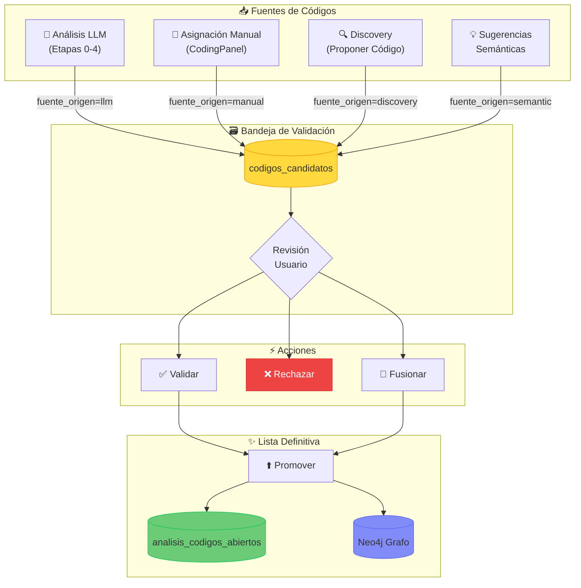

# Etapas 1–4: Arquitectura Manual vs Asistido

> **Actualizado: Diciembre 2024** - Verificado contra código actual

## Etapa 1 · Ingesta y normalización

### UI
- `frontend/src/components/IngestionPanel.tsx` - Panel de ingesta con:
  - Patrones de archivos (una ruta por línea)
  - Parámetros: batch_size, min/max chars
  - Polling de estado en tiempo real

### API
- `POST /api/ingest` → `app.ingestion.ingest_documents`

### Pipeline verificado
```
DOCX → documents.py (parse, speaker detection)
     → embeddings.embed_batch (Azure OpenAI)
     → qdrant_block.upsert (vectores)
     → neo4j_block.merge_fragments (grafo)
     → postgres_block.insert_fragments (códigos)
```

### Mejoras implementadas (Dic 2024)
- ✅ `batch_size` reducido a 20 (evita timeouts)
- ✅ Retry con exponential backoff (3 intentos)
- ✅ 9 índices de filtrado en Qdrant

---

## Etapa 3 · Codificación Abierta

La codificación abierta implementa un **modelo híbrido** que combina análisis asistido por IA con validación humana. Todos los códigos pasan por una bandeja de candidatos antes de ser definitivos.

---

### 3.1 📁 Entrevistas Ingeridas

Lista de archivos DOCX procesados durante la ingesta. Cada entrada muestra:
- Nombre del archivo
- Cantidad de fragmentos extraídos
- Actor principal detectado (o "sin especificar")
- Botones: **Usar** (seleccionar para análisis) y **Analizar** (ejecutar pipeline LLM)

---

### 3.2 🤖 Análisis Cualitativo Asistido (LLM)

Ejecuta el pipeline completo de análisis (Etapas 0-4) sobre una entrevista usando GPT-5.

| Campo | Descripción |
|-------|-------------|
| Entrevista | Selector de archivo a analizar |
| Ejecutar Análisis | Inicia pipeline LLM (puede tardar 1-3 min) |
| Eliminar Datos | Borra análisis previo del archivo |
| Guardar en Base de Datos | Persiste códigos en bandeja de candidatos |

**Pestañas de resultados:**
- **Resumen y Diagnóstico**: Etapas 0-2 (reflexividad, transcripción, descriptivo)
- **Matriz Abierta**: Etapa 3 (códigos + citas + fuentes)
- **Modelo Axial**: Etapa 4 (categorías y relaciones)

---

### 3.3 📋 Códigos Iniciales (IA)

Tabla editable con los códigos generados por el LLM antes de persistir:
- **Código**: Nombre emergente
- **Cita**: Fragmento textual de evidencia
- **Fuente**: Actor o entrevistado
- **Acciones**: Editar o eliminar antes de guardar

---

### 3.4 📝 Panel de Codificación Manual

Componente `CodingPanel.tsx` con 4 pestañas:

| Pestaña | Función |
|---------|---------|
| 📝 **Asignar código** | Registrar código manualmente a un fragmento |
| 🔍 **Sugerencias semánticas** | Fragmentos similares para comparación constante |
| 📊 **Cobertura y avance** | Estadísticas de saturación teórica |
| 📎 **Citas por código** | Ver todas las citas asociadas a un código |

---

### 3.5 🧠 GraphRAG - Chat con Contexto de Grafo

Interfaz conversacional que combina:
- Búsqueda semántica en fragmentos (Qdrant)
- Contexto estructural del grafo (Neo4j)
- Razonamiento paso a paso (Chain of Thought)

Permite hacer preguntas sobre los datos con respuestas fundamentadas en evidencia.

---

### 3.6 🔍 Discovery - Búsqueda Exploratoria

Búsqueda semántica avanzada con conceptos positivos y negativos:

| Campo | Descripción |
|-------|-------------|
| Conceptos Positivos | Términos a buscar (uno por línea) |
| Conceptos Negativos | Términos a excluir (opcional) |
| Texto Objetivo | Refinar con contexto adicional |
| Resultados | Cantidad de fragmentos a retornar |

**Acciones sobre resultados:**
- 💡 **Proponer Código**: Envía a bandeja de candidatos
- 📋 **Copiar**: Copia ID del fragmento
- 💾 **Guardar Memo**: Persiste notas del descubrimiento
- 🤖 **Sintetizar con IA**: Genera síntesis temática automática

---

### 3.7 🔮 Link Prediction - Sugerencias de Relaciones

Detecta relaciones axiales potenciales usando algoritmos de grafo:

| Algoritmo | Descripción |
|-----------|-------------|
| Preferential Attachment | Códigos populares tienden a conectarse más |
| Jaccard | Similitud basada en vecinos comunes |
| Adamic-Adar | Pondera vecinos por su rareza |

**Salida:** Tabla de pares (Fuente → Destino) con score de probabilidad.

---

### 3.8 🗃️ Bandeja de Códigos Candidatos

Centro de validación del modelo híbrido. Componente `CodeValidationPanel.tsx`.

| Estado | Icono | Descripción |
|--------|-------|-------------|
| Pendiente | ⏳ | Esperando revisión del usuario |
| Validado | ✅ | Aprobado, listo para promover |
| Rechazado | ❌ | Descartado por el usuario |
| Fusionado | 🔗 | Combinado con otro código |

**Orígenes (fuente_origen):**
- `llm` - Generado por análisis IA
- `manual` - Registrado desde CodingPanel
- `discovery` - Propuesto desde búsqueda exploratoria
- `semantic_suggestion` - Sugerido por similitud

---

### 3.9 📊 Informes de Análisis

Consolidado de reportes generados por el sistema:
- Informe por entrevista (métricas de codificación)
- Reporte de saturación teórica
- Estadísticas de cobertura

---

### Diagrama de Flujo Integrado



---

### API de Codificación

| Endpoint | Función |
|----------|---------|
| `POST /api/coding/assign` | Registrar código → candidatos |
| `POST /api/coding/suggest` | Sugerencias semánticas via Qdrant |
| `GET /api/coding/stats` | Estadísticas de cobertura |
| `GET /api/coding/codes` | Lista de códigos |
| `GET /api/coding/citations` | Citas por código |
| `POST /api/codes/candidates` | Crear código candidato |
| `PUT /api/codes/candidates/{id}/validate` | Validar candidato |
| `PUT /api/codes/candidates/{id}/reject` | Rechazar candidato |
| `POST /api/codes/candidates/merge` | Fusionar candidatos |
| `POST /api/codes/candidates/promote` | Promover a definitivos |

---

### Trazabilidad

| Componente | Tabla/Colección | Descripción |
|------------|-----------------|-------------|
| PostgreSQL | `codigos_candidatos` | Bandeja de validación |
| PostgreSQL | `analisis_codigos_abiertos` | Lista definitiva |
| Neo4j | `(:Fragmento)-[:TIENE_CODIGO]->(:Codigo)` | Grafo de códigos (tras promoción) |
| Qdrant | `fragmentos` | Embeddings para sugerencias |

---

## Etapa 4 · Codificación axial (manual)

### Lógica
- `app.axial.assign_axial_relation` con validación de tipos
- Tipos permitidos: `causa`, `condicion`, `consecuencia`, `partede`

### Persistencia
- PostgreSQL: `analisis_axial`
- Neo4j: `(:Categoria)-[:REL {tipo, memo}]->(:Codigo)`

### GDS Analytics (Dic 2024)
| Algoritmo | Propiedad persistida | UI |
|-----------|---------------------|-----|
| Louvain | `community_id` | ✅ Botón "Detectar Comunidades" |
| PageRank | `score_centralidad` | ✅ Botón "Calcular Importancia" |

---

## LLM Asistido (Etapas 0–4)

### UI
- `frontend/src/components/AnalysisPanel.tsx`
- Celery para tareas asíncronas

### API
- `POST /api/analyze` - Análisis LLM (async)
- `POST /api/analyze/persist` - Persistir resultados
- `GET /api/analyze/task/{id}` - Estado de tarea

### Mejoras implementadas (Dic 2024)

| Problema original | Solución |
|-------------------|----------|
| IDs sintéticos (`archivo#auto#index`) | ✅ `fragmento_idx` en prompt |
| Fallback sin match | ✅ `match_citation_to_fragment()` |
| Relaciones axiales sin tipo | ✅ `_infer_relation_type()` |

### Tasa de vinculación actual
```
~70% de códigos vinculados a fragmentos reales
(mejorado desde ~50% con fallback de citations)
```

---

## Plan de alineación IDs (Estado)

| Paso | Estado | Evidencia |
|------|--------|-----------|
| Forzar IDs reales | ✅ Implementado | `persist_analysis` usa `fragmento_idx` |
| Emitir IDs al LLM | ✅ Implementado | Prompt incluye índices |
| Validar evidencias axiales | ✅ Implementado | `_validate_evidence` |
| Script remapeo | ✅ Implementado | `scripts/remap_ghost_codes.py` |

---

*Última verificación: 13 Diciembre 2024*
