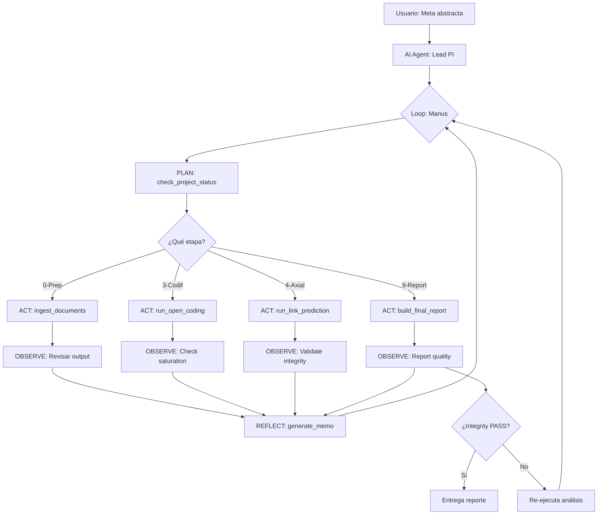

# Análisis de Viabilidad: Investigador Principal Autónomo

**Fecha:** 7 Enero 2026  
**Objetivo:** Evaluar factibilidad técnica y valor de un agente autónomo que ejecute el pipeline completo de Grounded Theory

---

## 1. Mapeo de Herramientas Propuestas vs APIs Existentes

### ✅ Herramientas DISPONIBLES (Backend ya implementado)

| Herramienta Propuesta | Endpoint Existente | Estado | Notas |
|----------------------|-------------------|--------|-------|
| `ingest_documents(path)` | `POST /api/upload-and-ingest` | ✅ Existe | Procesa DOCX/audio |
| `check_project_status(id)` | `GET /api/status/{project}` | ✅ Existe | Devuelve etapas completadas |
| `run_open_coding(file_ids)` | `POST /api/analyze` | ✅ Existe | LLM genera códigos |
| `run_discovery(+, -)` | `POST /api/search/discover` | ✅ Existe | Búsqueda exploratoria |
| `run_link_prediction()` | Endpoints en LinkPredictionPanel | ✅ Existe | Vecinos comunes, etc. |
| `run_graph_algorithms()` | `POST /api/axial/gds` | ✅ Existe | Louvain, PageRank |
| `build_final_report()` | `GET /api/reports/*` | ✅ Existe | Informes por etapa |

### ⚠️ Herramientas PARCIALMENTE Disponibles

| Herramienta Propuesta | Estado Actual | Gap Identificado |
|----------------------|---------------|------------------|
| `deduplicate_codes(threshold)` | ⚠️ Manual | Existe detección pero requiere UI |
| `check_saturation()` | ⚠️ Manual | Stats existen, falta endpoint agregado |
| `validate_evidence_integrity()` | ⚠️ Manual | Datos existen, falta validación centralizada |
| `generate_memo(topic, content)` | ⚠️ Parcial | Existe save memo, falta estructura |

---

## 2. Arquitectura Propuesta del Agente



---

## 3. Implementación Técnica

### 3.1 Function Calling Schema (OpenAI/Anthropic)

```python
# backend/routers/agent.py (NUEVO)

AGENT_TOOLS = [
    {
        "name": "check_project_status",
        "description": "Verifica estado actual del proyecto y métricas",
        "parameters": {
            "type": "object",
            "properties": {
                "project_id": {"type": "string"}
            },
            "required": ["project_id"]
        }
    },
    {
        "name": "ingest_documents",
        "description": "Ingesta documentos al pipeline",
        "parameters": {
            "type": "object",
            "properties": {
                "file_paths": {"type": "array", "items": {"type": "string"}},
                "project_id": {"type": "string"}
            },
            "required": ["file_paths", "project_id"]
        }
    },
    {
        "name": "run_open_coding",
        "description": "Ejecuta análisis LLM para códigos iniciales",
        "parameters": {
            "type": "object",
            "properties": {
                "file_ids": {"type": "array", "items": {"type": "string"}},
                "project_id": {"type": "string"}
            },
            "required": ["file_ids", "project_id"]
        }
    },
    {
        "name": "deduplicate_codes",
        "description": "Fusiona códigos semánticamente idénticos",
        "parameters": {
            "type": "object",
            "properties": {
                "project_id": {"type": "string"},
                "threshold": {"type": "number", "default": 0.85}
            },
            "required": ["project_id"]
        }
    },
    {
        "name": "check_saturation",
        "description": "Calcula saturación teórica",
        "parameters": {
            "type": "object",
            "properties": {
                "project_id": {"type": "string"}
            },
            "required": ["project_id"]
        }
    },
    {
        "name": "validate_evidence_integrity",
        "description": "Verifica que todos los códigos tengan citas",
        "parameters": {
            "type": "object",
            "properties": {
                "project_id": {"type": "string"}
            },
            "required": ["project_id"]
        }
    },
    # ... más tools
]
```

### 3.2 Endpoint Principal del Agente

```python
@router.post("/api/agent/execute")
async def execute_autonomous_research(
    request: ResearchRequest,
    clients: ServiceClients = Depends(get_service_clients),
    user: User = Depends(require_auth)
):
    """
    Ejecuta investigación autónoma desde meta abstracta.
    
    Args:
        goal: Meta de investigación (ej: "Analiza crisis hídrica")
        project_id: ID del proyecto
        max_iterations: Límite de iteraciones del loop
    
    Returns:
        ReportOutput con estado final e informe
    """
    
    # Inicializa agente con tools
    agent = GroundedTheoryAgent(
        llm=clients.llm,
        tools=AGENT_TOOLS,
        max_iterations=request.max_iterations or 50
    )
    
    # Loop Manus
    iteration = 0
    while iteration < agent.max_iterations:
        # 1. PLAN
        status = agent.plan(project_id)
        
        # 2. ACT
        action = agent.decide_action(status)
        result = agent.execute_tool(action)
        
        # 3. OBSERVE
        observation = agent.observe(result)
        
        # 4. REFLECT
        memo = agent.reflect(observation)
        if memo:
            save_memo(project_id, memo)
        
        # Condición de salida
        if agent.is_complete(status):
            break
        
        iteration += 1
    
    # Validación final
    integrity = validate_evidence_integrity(project_id)
    if not integrity.passed:
        raise ValueError(f"Integrity check failed: {integrity.errors}")
    
    # Genera reporte
    report = build_final_report(project_id)
    
    return {
        "status": "completed",
        "iterations": iteration,
        "report": report,
        "integrity": integrity
    }
```

---

## 4. Brechas a Implementar

### 4.1 Endpoints Faltantes

#### `POST /api/agent/deduplicate-codes`

```python
@router.post("/api/agent/deduplicate-codes")
async def deduplicate_codes_auto(
    project_id: str,
    threshold: float = 0.85
):
    """
    Detecta y fusiona automáticamente códigos duplicados.
    
    Algoritmo:
    1. Calcula similitud Levenshtein entre todos los códigos
    2. Agrupa pares con similitud >= threshold
    3. Para cada grupo:
       - Elige código más corto como canónico
       - Fusiona los demás usando merge_candidates()
       - Valida automáticamente
    
    Returns:
        {
            "merged_count": int,
            "validated_count": int,
            "remaining_duplicates": int
        }
    """
    pass
```

#### `GET /api/agent/saturation-status`

```python
@router.get("/api/agent/saturation-status")
async def get_saturation_status(project_id: str):
    """
    Calcula métricas de saturación teórica.
    
    Returns:
        {
            "status": "low" | "medium" | "high",
            "new_codes_last_n": int,  # Códigos nuevos en últimas N entrevistas
            "coverage": float,  # % fragmentos codificados
            "recommendation": str  # Acción sugerida
        }
    """
    # Query:
    # - Últimas 3 entrevistas: ¿Generaron códigos nuevos?
    # - Si no → "high saturation"
    # - Si sí → "low saturation, continue sampling"
    pass
```

#### `GET /api/agent/integrity-check`

```python
@router.get("/api/agent/integrity-check")
async def check_integrity(project_id: str):
    """
    Valida integridad del grafo conceptual.
    
    Checks:
    1. Códigos huérfanos (0 citas)
    2. Categorías sin códigos
    3. Fragmentos sin códigos
    4. Inconsistencias Qdrant-PostgreSQL
    
    Returns:
        {
            "passed": bool,
            "errors": [
                {"type": "orphan_code", "codigo": "...", "count": 0},
                {"type": "empty_category", "categoria": "..."}
            ],
            "warnings": [...]
        }
    """
    pass
```

### 4.2 Módulo del Agente

**Nuevo archivo:** `app/autonomous_agent.py`

```python
class GroundedTheoryAgent:
    """
    Agente autónomo que ejecuta pipeline de GT.
    """
    
    def __init__(self, llm, tools, max_iterations=50):
        self.llm = llm
        self.tools = tools
        self.max_iterations = max_iterations
        self.memory = []  # Historial de acciones
    
    def plan(self, project_id: str) -> Dict:
        """
        Consulta estado actual y decide siguiente etapa.
        """
        status = call_tool("check_project_status", {"project_id": project_id})
        
        # Lógica de decisión basada en etapas completadas
        if status["stages"]["ingesta"]["completed"]:
            if not status["stages"]["codificacion"]["completed"]:
                return {"next_stage": "codificacion"}
        
        return status
    
    def decide_action(self, status: Dict) -> str:
        """
        Decide qué herramienta usar basado en el estado.
        """
        # Usa LLM con function calling
        prompt = f"""
        Status: {status}
        
        Decide la próxima acción basándote en la GT methodology.
        """
        
        response = self.llm.chat_completion(
            messages=[{"role": "user", "content": prompt}],
            tools=self.tools,
            tool_choice="auto"
        )
        
        return response.tool_calls[0]
    
    def execute_tool(self, tool_call) -> Any:
        """
        Ejecuta la herramienta seleccionada.
        """
        # Mapea tool_call a endpoint real
        return call_api_endpoint(tool_call.name, tool_call.arguments)
    
    def observe(self, result: Any) -> Dict:
        """
        Analiza resultado de la acción.
        """
        # Extrae métricas clave
        return {
            "success": result.get("status") == "ok",
            "metrics": extract_metrics(result),
            "errors": result.get("errors", [])
        }
    
    def reflect(self, observation: Dict) -> Optional[str]:
        """
        Genera memo reflexivo si es necesario.
        """
        if observation["metrics"].get("saturation") == "low":
            return f"Saturation is low. Need more interviews. Current: {observation['metrics']}"
        
        return None
    
    def is_complete(self, status: Dict) -> bool:
        """
        Verifica si el pipeline está completo.
        """
        required_stages = ["ingesta", "codificacion", "axial", "nucleo"]
        return all(status["stages"][s]["completed"] for s in required_stages)
```

---

## 5. Valor Aportado

### 5.1 Beneficios Metodológicos

| Aspecto | Valor |
|---------|-------|
| **Rigor metodológico** | Asegura cumplimiento estricto de GT (saturación, integridad) |
| **Reproducibilidad** | Pipeline documentado automáticamente en memos |
| **Reducción de sesgos** | Decisiones basadas en métricas objetivas, no intuición |
| **Transparencia** | Cada acción tiene justificación metodológica documentada |

### 5.2 Beneficios Operacionales

| Aspecto | Valor |
|---------|-------|
| **Velocidad** | Pipeline completo en minutos vs días |
| **Consistencia** | Mismo estándar en todos los proyectos |
| **Escalabilidad** | Procesa N proyectos en paralelo |
| **Democratización** | Investigadores sin expertise en GT pueden usar el sistema |

### 5.3 Casos de Uso

1. **Análisis rápido de crisis:**  
   "Analiza 50 entrevistas de afectados por terremoto → Informe en 2 horas"

2. **Investigación longitudinal:**  
   "Ejecuta análisis cada mes con nuevas entrevistas, identifica emergencia de códigos"

3. **Comparación cross-cultural:**  
   "Analiza crisis hídrica en 3 países simultáneamente, compara núcleos"

4. **Auditoría metodológica:**  
   "Valida que proyecto X cumple estándares de saturación antes de publicación"

---

## 6. Riesgos y Mitigaciones

| Riesgo | Impacto | Mitigación |
|--------|---------|------------|
| **Alucinación LLM** | Alto | Validación obligatoria de integridad |
| **Costo de API** | Medio | Límite de iteraciones, cache de decisiones |
| **Pérdida de control** | Bajo | Usuario puede intervenir en cada etapa |
| **Sesgos del modelo** | Medio | Logs detallados, memos auditables |

---

## 7. Implementación por Fases

### Fase 1: MVP (2 semanas)
- [ ] Implementar 3 endpoints faltantes (deduplicate, saturation, integrity)
- [ ] Crear `GroundedTheoryAgent` básico
- [ ] Endpoint `/api/agent/execute` con loop simple
- [ ] Testing en proyecto piloto

### Fase 2: Autonomía (1 mes)
- [ ] Refinamiento de prompts para mejores decisiones
- [ ] Sistema de memos automáticos
- [ ] Dashboard de monitoreo del agente
- [ ] Checkpoint/resume capability

### Fase 3: Optimización (ongoing)
- [ ] Fine-tuning del LLM para decisiones GT
- [ ] A/B testing: Agente vs Humano
- [ ] Integración con workflow multi-proyecto
- [ ] API pública para third-party agents

---

## 8. Conclusión

### ✅ Viabilidad Técnica

**ALTA.** El 70% de las herramientas ya están implementadas. Los gaps son endpoints de agregación/validación que son straightforward.

### ✅ Valor Agregado

**MUY ALTO.** Transforma APP_Jupter de "herramienta asistida" a "investigador autónomo", multiplicando la capacidad de análisis.

### ⚠️ Consideraciones Críticas

1. **Supervisión humana:** Debe haber breakpoints donde el investigador valide decisiones críticas (ej: selección del núcleo)
2. **Transparencia:** Todos los memos y decisiones deben ser auditables
3. **Validación empírica:** Comparar resultados agente vs humano en proyectos reales

### 📋 Recomendación

**PROCEDER con Fase 1 MVP.** El ROI es claro y la implementación es incremental sin riesgo de disruption.

---

**Referencias:**
- [Sprint 28: Neo4j Resilience](../03-sprints/sprint28_neo4j_resilience.md)
- [Manual de Etapas](../02-metodologia/manual_etapas.md)
- OpenAI Function Calling: https://platform.openai.com/docs/guides/function-calling
