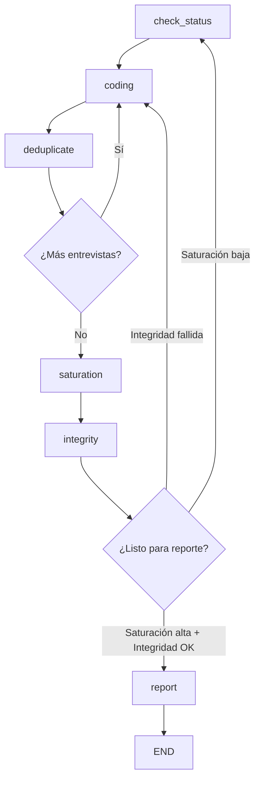

# Evaluación Estratégica: Lecciones de Startups para APP_Jupter

**Fecha:** 7 Enero 2026  
**Objetivo:** Evaluar valor e implementación de features inspirados en Hebbia, Elicit, Devin y LangGraph

---

## Resumen Ejecutivo

| Concepto | Fuente | Valor | Esfuerzo | Prioridad |
|----------|--------|-------|----------|-----------|
| **Matrix UI** | Hebbia | 🔥 Muy Alto | 3 semanas | 🔴 P1 |
| **Panel de Observabilidad** | Devin | 🔥 Muy Alto | 2 semanas | 🔴 P1 |
| **Linkage Estricto** | Elicit | ✅ Existente | - | ✅ Hecho |
| **LangGraph Orchestration** | LangChain | 🟡 Alto | 4 semanas | 🟡 P2 |
| **DeepSeek R1 Integration** | DeepSeek | 💰 Costo muy bajo | 1 semana | 🔴 P1 |

---

## 1. Matrix UI (Inspirado en Hebbia)

### Concepto Original
> "En lugar de chatear uno a uno, el usuario define 5 códigos (columnas) y el Agente llena la tabla para las 50 entrevistas (filas) automáticamente."

### Valor para APP_Jupter

| Aspecto | Impacto |
|---------|---------|
| **Escalabilidad** | Procesar 50 entrevistas en paralelo vs una por una |
| **Comparabilidad** | Ver todos los códigos side-by-side |
| **Eficiencia** | Reducir tiempo de codificación 10x |
| **Rigor metodológico** | Applies misma heurística a todas las entrevistas |

### Implementación Técnica

```
┌─────────────────────────────────────────────────────────────────┐
│                    MATRIX CODING UI                             │
├─────────────────────────────────────────────────────────────────┤
│                                                                 │
│  Columnas = Categorías/Códigos a Buscar                        │
│  ├── "Escasez hídrica"                                         │
│  ├── "Conflicto institucional"                                 │
│  ├── "Resiliencia comunitaria"                                 │
│  └── "Soluciones técnicas"                                     │
│                                                                 │
│  Filas = Entrevistas                                           │
│  ├── Entrevista_Alcalde.docx                                   │
│  ├── Entrevista_Vecino_1.docx                                  │
│  ├── Entrevista_ONG.docx                                       │
│  └── ...                                                       │
│                                                                 │
│              ┌──────────┬───────────┬───────────┬──────────┐   │
│              │ Escasez  │ Conflicto │Resiliencia│ Técnicas │   │
│  ┌───────────┼──────────┼───────────┼───────────┼──────────┤   │
│  │ Alcalde   │ 3 citas  │ 5 citas   │ 1 cita    │ 2 citas  │   │
│  ├───────────┼──────────┼───────────┼───────────┼──────────┤   │
│  │ Vecino_1  │ 7 citas  │ 0         │ 4 citas   │ 0        │   │
│  ├───────────┼──────────┼───────────┼───────────┼──────────┤   │
│  │ ONG       │ 2 citas  │ 8 citas   │ 6 citas   │ 3 citas  │   │
│  └───────────┴──────────┴───────────┴───────────┴──────────┘   │
│                                                                 │
│  [Click celda] → Expandir citas con fragmentos originales      │
│                                                                 │
└─────────────────────────────────────────────────────────────────┘
```

### Componentes a Crear

#### Frontend: `MatrixCodingPanel.tsx`

```typescript
interface MatrixCell {
  archivo: string;
  codigo: string;
  citas: Array<{
    fragmento_id: string;
    texto: string;
    score: number;
  }>;
  count: number;
}

interface MatrixRow {
  archivo: string;
  cells: Record<string, MatrixCell>;
}

function MatrixCodingPanel({ project }: { project: string }) {
  const [codes, setCodes] = useState<string[]>(["escasez", "conflicto"]);
  const [matrix, setMatrix] = useState<MatrixRow[]>([]);
  const [loading, setLoading] = useState(false);
  const [expandedCell, setExpandedCell] = useState<MatrixCell | null>(null);
  
  const handleFillMatrix = async () => {
    setLoading(true);
    const result = await apiFetch('/api/matrix/fill', {
      method: 'POST',
      body: JSON.stringify({ project, codes })
    });
    setMatrix(result.matrix);
    setLoading(false);
  };
  
  return (
    <div className="matrix-panel">
      {/* Header: Code columns */}
      <div className="matrix-header">
        {codes.map(code => (
          <input 
            key={code} 
            value={code} 
            onChange={e => updateCode(code, e.target.value)}
          />
        ))}
        <button onClick={() => setCodes([...codes, ''])}>+ Código</button>
      </div>
      
      {/* Grid */}
      <table className="matrix-grid">
        <thead>
          <tr>
            <th>Entrevista</th>
            {codes.map(code => <th key={code}>{code}</th>)}
          </tr>
        </thead>
        <tbody>
          {matrix.map(row => (
            <tr key={row.archivo}>
              <td>{row.archivo}</td>
              {codes.map(code => (
                <td 
                  key={code}
                  className={getCellClass(row.cells[code]?.count)}
                  onClick={() => setExpandedCell(row.cells[code])}
                >
                  {row.cells[code]?.count || 0}
                </td>
              ))}
            </tr>
          ))}
        </tbody>
      </table>
      
      {/* Fill button */}
      <button onClick={handleFillMatrix} disabled={loading}>
        {loading ? 'Llenando matriz...' : '🔄 Llenar Matriz con IA'}
      </button>
      
      {/* Expanded cell modal */}
      {expandedCell && (
        <CellDetailModal 
          cell={expandedCell} 
          onClose={() => setExpandedCell(null)}
        />
      )}
    </div>
  );
}
```

#### Backend: `/api/matrix/fill`

```python
@router.post("/api/matrix/fill")
async def fill_coding_matrix(
    request: MatrixFillRequest,
    clients: ServiceClients = Depends(get_service_clients)
):
    """
    Llena matriz de codificación usando búsqueda semántica.
    
    Para cada (entrevista, código):
    1. Buscar en Qdrant fragmentos relevantes
    2. Filtrar por archivo
    3. Retornar top N citas
    """
    matrix = []
    
    # Obtener lista de archivos
    interviews = list_interviews_summary(clients.postgres, request.project)
    
    for interview in interviews:
        row = {"archivo": interview["archivo"], "cells": {}}
        
        for code in request.codes:
            # Búsqueda semántica por código
            results = search_similar_qdrant(
                clients.qdrant,
                query=code,
                project=request.project,
                filters={"archivo": interview["archivo"]},
                limit=10
            )
            
            row["cells"][code] = {
                "citas": [
                    {
                        "fragmento_id": r.id,
                        "texto": r.payload["text"][:200],
                        "score": r.score
                    }
                    for r in results
                    if r.score > 0.5  # Threshold
                ],
                "count": len([r for r in results if r.score > 0.5])
            }
        
        matrix.append(row)
    
    return {"matrix": matrix}
```

### Esfuerzo Estimado: **3 semanas**
- Frontend: 2 semanas (nuevo componente complejo)
- Backend: 1 semana (combina endpoints existentes)

---

## 2. Panel de Observabilidad (Inspirado en Devin)

### Concepto Original
> "Tu interfaz debería tener un 'Panel de Pensamiento'. Cuando el agente esté haciendo Link Prediction o Saturación, no muestres un spinner girando. Muestra los logs."

### Valor para APP_Jupter

| Aspecto | Impacto |
|---------|---------|
| **Confianza** | Usuario ve exactamente qué hace la IA |
| **Debugging** | Identificar problemas rápidamente |
| **Transparencia metodológica** | Documenta decisiones del agente |
| **Educación** | Usuario aprende el proceso de GT |

### Implementación Técnica

```
┌────────────────────────────────────────────────────────────────┐
│                 AGENT THINKING PANEL                           │
├────────────────────────────────────────────────────────────────┤
│                                                                │
│  ┌─────────────────────────────────────────────────────────┐  │
│  │ 📊 PLAN                                                 │  │
│  │ ├── Status: Etapa 3 (Codificación Abierta)             │  │
│  │ ├── Entrevistas sin codificar: 12                      │  │
│  │ └── Próxima acción: run_open_coding                    │  │
│  └─────────────────────────────────────────────────────────┘  │
│                                                                │
│  ┌─────────────────────────────────────────────────────────┐  │
│  │ ⚡ ACCIÓN EN CURSO                                      │  │
│  │ • Procesando: Entrevista_Vecino_3.docx                 │  │
│  │ • Fragmentos analizados: 34/52                         │  │
│  │ • Códigos detectados: 8 nuevos, 4 duplicados           │  │
│  │   ├── escasez_agua (nuevo)                             │  │
│  │   ├── corte_suministro → fusionado con escasez_agua   │  │
│  │   └── conflicto_vecinal (nuevo)                        │  │
│  └─────────────────────────────────────────────────────────┘  │
│                                                                │
│  ┌─────────────────────────────────────────────────────────┐  │
│  │ 📈 MÉTRICAS                                             │  │
│  │ • Saturación: 67% (medium)                             │  │
│  │ • Linkage Rate: 94.2%                                  │  │
│  │ • Duplicados pendientes: 3                             │  │
│  │ • PageRank top: "gobernanza_local" (0.87)              │  │
│  └─────────────────────────────────────────────────────────┘  │
│                                                                │
│  ┌─────────────────────────────────────────────────────────┐  │
│  │ 📜 REASONING LOG                                        │  │
│  │ 15:42:01 [PLAN] Detecté 12 entrevistas sin códigos     │  │
│  │ 15:42:03 [ACT] Iniciando run_open_coding para lote 1   │  │
│  │ 15:42:15 [OBSERVE] 8 códigos generados, 4 duplicados   │  │
│  │ 15:42:16 [ACT] deduplicate_codes(threshold=0.85)       │  │
│  │ 15:42:18 [REFLECT] Fusioné "corte" con "escasez"       │  │
│  │          porque comparten 91% vecindad en grafo        │  │
│  └─────────────────────────────────────────────────────────┘  │
│                                                                │
└────────────────────────────────────────────────────────────────┘
```

### Componentes a Crear

#### WebSocket para streaming de logs

```python
# backend/routers/agent_ws.py

from fastapi import WebSocket
import asyncio

connected_clients: Dict[str, WebSocket] = {}

@router.websocket("/ws/agent/{project_id}")
async def agent_websocket(websocket: WebSocket, project_id: str):
    await websocket.accept()
    connected_clients[project_id] = websocket
    
    try:
        while True:
            # Keep connection alive
            await asyncio.sleep(30)
            await websocket.send_json({"type": "ping"})
    except:
        del connected_clients[project_id]

async def broadcast_agent_log(project_id: str, log: Dict):
    """Envía log a todos los clientes conectados al proyecto."""
    if project_id in connected_clients:
        await connected_clients[project_id].send_json(log)

# Uso en el agente:
async def run_open_coding(project_id, file_ids):
    await broadcast_agent_log(project_id, {
        "type": "action",
        "stage": "ACT",
        "message": f"Iniciando codificación de {len(file_ids)} archivos"
    })
    
    for i, file_id in enumerate(file_ids):
        await broadcast_agent_log(project_id, {
            "type": "progress",
            "current": i + 1,
            "total": len(file_ids),
            "file": file_id
        })
        # ... procesamiento ...
    
    await broadcast_agent_log(project_id, {
        "type": "result",
        "codes_new": 8,
        "codes_merged": 4
    })
```

#### Frontend: `AgentThinkingPanel.tsx`

```typescript
function AgentThinkingPanel({ project }: { project: string }) {
  const [logs, setLogs] = useState<AgentLog[]>([]);
  const [metrics, setMetrics] = useState<AgentMetrics | null>(null);
  const [currentAction, setCurrentAction] = useState<string | null>(null);
  
  useEffect(() => {
    const ws = new WebSocket(`ws://localhost:8000/ws/agent/${project}`);
    
    ws.onmessage = (event) => {
      const data = JSON.parse(event.data);
      
      if (data.type === 'action') {
        setCurrentAction(data.message);
      } else if (data.type === 'progress') {
        setMetrics(prev => ({ ...prev, progress: data }));
      } else if (data.type === 'log') {
        setLogs(prev => [...prev, data].slice(-50)); // Keep last 50
      }
    };
    
    return () => ws.close();
  }, [project]);
  
  return (
    <aside className="agent-thinking-panel">
      <section className="panel-plan">
        <h4>📊 PLAN</h4>
        <StatusDisplay project={project} />
      </section>
      
      <section className="panel-action">
        <h4>⚡ ACCIÓN EN CURSO</h4>
        {currentAction ? (
          <div className="action-current">{currentAction}</div>
        ) : (
          <div className="action-idle">Esperando...</div>
        )}
        {metrics?.progress && (
          <ProgressBar 
            current={metrics.progress.current} 
            total={metrics.progress.total}
          />
        )}
      </section>
      
      <section className="panel-metrics">
        <h4>📈 MÉTRICAS</h4>
        <MetricsGrid project={project} />
      </section>
      
      <section className="panel-logs">
        <h4>📜 REASONING LOG</h4>
        <div className="logs-container">
          {logs.map((log, i) => (
            <LogEntry key={i} log={log} />
          ))}
        </div>
      </section>
    </aside>
  );
}
```

### Esfuerzo Estimado: **2 semanas**
- WebSocket backend: 3 días
- Frontend panel: 1 semana
- Integración con agente: 4 días

---

## 3. Linkage Estricto (Inspirado en Elicit)

### Concepto Original
> "Mantén el hipervínculo estricto a la cita original (tu fragment_id)."

### Estado Actual: ✅ YA IMPLEMENTADO

APP_Jupter ya tiene esto:

| Feature | Implementación Existente |
|---------|--------------------------|
| `fragment_id` único | UUID en `entrevista_fragmentos` |
| Linkage en códigos | `analisis_codigos_abiertos.fragmento_id` |
| Validación | `validate_citation_integrity()` en analysis.py |
| Linkage Rate | Métrica calculada en `/api/coding/stats` |

### Mejora Sugerida: Visualización de Linkage

```typescript
// Componente que muestra el fragmento original al hover sobre cualquier cita
function CitationLink({ fragmentId }: { fragmentId: string }) {
  const [fragment, setFragment] = useState<Fragment | null>(null);
  
  return (
    <Tooltip 
      content={
        <div className="citation-preview">
          <blockquote>{fragment?.text}</blockquote>
          <footer>
            📄 {fragment?.archivo} | par_idx {fragment?.fragmento_idx}
          </footer>
        </div>
      }
    >
      <span className="citation-id">[{fragmentId.slice(0, 8)}...]</span>
    </Tooltip>
  );
}
```

---

## 4. LangGraph Orchestration

### Concepto Original
> "LangGraph te permite definir el flujo como un Grafo de Estados (StateGraph)."

### Valor para APP_Jupter

| Aspecto | Impacto |
|---------|---------|
| **Robustez** | Manejo de errores y reintentos built-in |
| **Checkpoints** | Pausar/resumir ejecución sin perder estado |
| **Branching** | Condicionales complejos (saturación, integridad) |
| **Observabilidad** | Tracing nativo compatible con LangSmith |

### Implementación Técnica

```python
# app/agent_graph.py

from langgraph.graph import StateGraph, END
from typing import TypedDict, Optional

class GTState(TypedDict):
    project_id: str
    current_stage: str
    interviews_pending: list[str]
    codes_count: int
    saturation_level: str  # "low" | "medium" | "high"
    integrity_passed: bool
    memos: list[str]
    errors: list[str]

def check_status(state: GTState) -> GTState:
    """Nodo: Verifica estado del proyecto."""
    status = get_project_status(state["project_id"])
    state["current_stage"] = status["current_stage"]
    state["interviews_pending"] = status["uncoded_interviews"]
    return state

def run_coding(state: GTState) -> GTState:
    """Nodo: Ejecuta codificación abierta."""
    results = run_open_coding(
        state["project_id"], 
        state["interviews_pending"][:5]  # Batch de 5
    )
    state["codes_count"] += results["new_codes"]
    state["interviews_pending"] = state["interviews_pending"][5:]
    return state

def deduplicate(state: GTState) -> GTState:
    """Nodo: Fusiona códigos duplicados."""
    results = deduplicate_codes(state["project_id"], threshold=0.85)
    state["codes_count"] -= results["merged_count"]
    return state

def check_saturation(state: GTState) -> GTState:
    """Nodo: Evalúa saturación teórica."""
    saturation = get_saturation_status(state["project_id"])
    state["saturation_level"] = saturation["status"]
    return state

def validate_integrity(state: GTState) -> GTState:
    """Nodo: Valida integridad del grafo."""
    integrity = check_evidence_integrity(state["project_id"])
    state["integrity_passed"] = integrity["passed"]
    state["errors"].extend(integrity.get("errors", []))
    return state

def generate_report(state: GTState) -> GTState:
    """Nodo: Genera informe final."""
    report = build_final_report(state["project_id"])
    return state

def should_continue_coding(state: GTState) -> str:
    """Decisión: ¿Más codificación necesaria?"""
    if state["interviews_pending"]:
        return "coding"  # Más entrevistas por procesar
    return "saturation"  # Verificar saturación

def should_generate_report(state: GTState) -> str:
    """Decisión: ¿Listo para reporte?"""
    if state["saturation_level"] == "high" and state["integrity_passed"]:
        return "report"
    elif state["saturation_level"] == "low":
        return "discovery"  # Necesita más datos
    return "fix_integrity"  # Arreglar problemas

# Construir el grafo
workflow = StateGraph(GTState)

# Agregar nodos
workflow.add_node("check_status", check_status)
workflow.add_node("coding", run_coding)
workflow.add_node("deduplicate", deduplicate)
workflow.add_node("saturation", check_saturation)
workflow.add_node("integrity", validate_integrity)
workflow.add_node("report", generate_report)

# Agregar edges
workflow.set_entry_point("check_status")
workflow.add_edge("check_status", "coding")
workflow.add_edge("coding", "deduplicate")
workflow.add_conditional_edges(
    "deduplicate",
    should_continue_coding,
    {
        "coding": "coding",
        "saturation": "saturation"
    }
)
workflow.add_edge("saturation", "integrity")
workflow.add_conditional_edges(
    "integrity",
    should_generate_report,
    {
        "report": "report",
        "discovery": "check_status",  # Loop back
        "fix_integrity": "coding"
    }
)
workflow.add_edge("report", END)

# Compilar
app = workflow.compile()

# Ejecutar
async def run_gt_pipeline(project_id: str):
    initial_state = GTState(
        project_id=project_id,
        current_stage="",
        interviews_pending=[],
        codes_count=0,
        saturation_level="low",
        integrity_passed=False,
        memos=[],
        errors=[]
    )
    
    final_state = await app.ainvoke(initial_state)
    return final_state
```

### Diagrama del Grafo



### Esfuerzo Estimado: **4 semanas**
- Setup LangGraph: 1 semana
- Migrar lógica actual: 2 semanas
- Testing y refinamiento: 1 semana

---

## 5. DeepSeek R1 Integration

### Concepto Original
> "Usa modelos chinos para que los bucles infinitos sean baratos."

### Valor para APP_Jupter

| Modelo | Costo/1M tokens | Uso Ideal |
|--------|-----------------|-----------|
| GPT-4o | $5.00 | Decisiones críticas (núcleo) |
| **DeepSeek R1** | **$0.55** | Codificación masiva, loops |
| Claude 3.5 | $3.00 | Reasoning complejo |

**Ahorro:** 90% en operaciones repetitivas (codificación de 100 entrevistas)

### Implementación

```python
# app/llm_router.py

from enum import Enum
from typing import Literal

class LLMTask(Enum):
    CODING_BATCH = "coding_batch"      # Barato, repetitivo
    NUCLEUS_SELECTION = "nucleus"       # Crítico, razonamiento
    DEDUPLICATION = "dedup"             # Barato, comparación
    REPORT_GENERATION = "report"        # Medio, síntesis
    DISCOVERY = "discovery"             # Barato, búsqueda

# Routing table
LLM_ROUTING = {
    LLMTask.CODING_BATCH: "deepseek-chat",
    LLMTask.NUCLEUS_SELECTION: "gpt-4o",
    LLMTask.DEDUPLICATION: "deepseek-chat",
    LLMTask.REPORT_GENERATION: "gpt-4o",
    LLMTask.DISCOVERY: "deepseek-chat",
}

async def call_llm(task: LLMTask, messages: list[dict]) -> str:
    """
    Enruta llamada al modelo óptimo según la tarea.
    """
    model = LLM_ROUTING[task]
    
    if model.startswith("deepseek"):
        return await call_deepseek(model, messages)
    elif model.startswith("gpt"):
        return await call_openai(model, messages)
    else:
        return await call_azure(model, messages)

async def call_deepseek(model: str, messages: list[dict]) -> str:
    """Llama a DeepSeek API."""
    client = OpenAI(
        api_key=os.getenv("DEEPSEEK_API_KEY"),
        base_url="https://api.deepseek.com/v1"
    )
    
    response = await client.chat.completions.create(
        model=model,
        messages=messages
    )
    
    return response.choices[0].message.content
```

### .env adicional

```env
# DeepSeek (90% más barato que GPT-4)
DEEPSEEK_API_KEY=sk-xxxxx
DEEPSEEK_BASE_URL=https://api.deepseek.com/v1
```

### Esfuerzo Estimado: **1 semana**
- Setup client: 2 días
- Router implementation: 2 días
- Testing: 3 días

---

## 6. Resumen de Implementación

### Roadmap Propuesto

```
┌────────────────────────────────────────────────────────────────┐
│                    ROADMAP FRANKENSTEIN                        │
├────────────────────────────────────────────────────────────────┤
│                                                                │
│  Sprint 29 (2 semanas):                                        │
│  ├── DeepSeek R1 integration                                  │
│  └── Panel de Observabilidad (WebSocket + UI)                 │
│                                                                │
│  Sprint 30 (3 semanas):                                        │
│  ├── Matrix Coding UI                                          │
│  └── Endpoint /api/matrix/fill                                │
│                                                                │
│  Sprint 31 (4 semanas):                                        │
│  ├── LangGraph orchestration                                  │
│  └── Migración de agente autónomo                             │
│                                                                │
│  Sprint 32 (2 semanas):                                        │
│  ├── Refinamiento y testing                                   │
│  └── Documentación y demo                                     │
│                                                                │
│  TOTAL: ~11 semanas para transformación completa              │
│                                                                │
└────────────────────────────────────────────────────────────────┘
```

### Presupuesto Estimado (LLM costs)

| Escenario | Modelo Actual (GPT-4o) | Con DeepSeek R1 |
|-----------|------------------------|-----------------|
| 100 entrevistas | $50 | $5.50 |
| 1000 entrevistas | $500 | $55 |
| **Ahorro anual** (10 proyectos/mes) | - | **~$5,000** |

---

## 7. Conclusión

### ✅ Alto Valor, Viables

| Feature | Valor | Esfuerzo | ROI |
|---------|-------|----------|-----|
| **DeepSeek R1** | 💰 90% ahorro | 1 semana | 🔥 Muy Alto |
| **Panel Observabilidad** | 🔍 Confianza | 2 semanas | 🔥 Muy Alto |
| **Matrix UI** | 📊 10x velocidad | 3 semanas | 🔥 Muy Alto |

### 🟡 Alto Valor, Mayor Inversión

| Feature | Valor | Esfuerzo | ROI |
|---------|-------|----------|-----|
| **LangGraph** | 🔧 Robustez | 4 semanas | 🟡 Alto |

### ✅ Ya Existente

| Feature | Estado |
|---------|--------|
| **Linkage estricto (Elicit)** | ✅ Implementado |

### Recomendación Final

**Sprint 29 MVP:** DeepSeek + Observabilidad = **3 semanas**

Esto entrega valor inmediato (ahorro de costos + transparencia) mientras se planifica Matrix UI y LangGraph.
