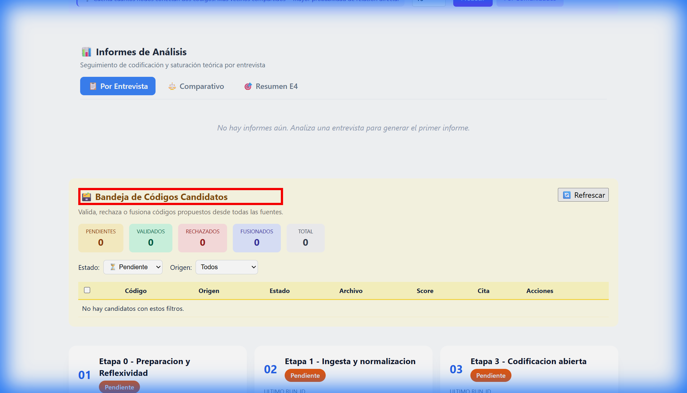

# Lecciones Aprendidas - Prueba UX/UI
**Fecha:** 2025-12-21  
**Sesión:** Debugging del CodeValidationPanel  
**Duración de Debugging:** ~50 minutos

---

## 1. Resumen Ejecutivo

Durante la implementación del sistema de consolidación de códigos candidatos, la prueba de usuario reveló que el componente `CodeValidationPanel` no se renderizaba en absoluto, a pesar de que todo el código frontend estaba correctamente implementado.

### Causa Raíz
La desconexión entre capas de la arquitectura:
- **Frontend:** Componente y servicios API implementados ✅
- **Backend:** Endpoints de API **NO implementados** ❌
- **Base de datos:** Funciones de PostgreSQL implementadas ✅

### Impacto en UX
- Panel completamente invisible (no errores visibles)
- Usuario sin feedback de qué estaba fallando
- Tiempo perdido buscando el problema en el lugar equivocado

---

## 2. Problemas Identificados

### 2.1 Endpoints de Backend Faltantes

| Endpoint Esperado | Estado |
|-------------------|--------|
| `GET /api/codes/candidates` | ❌ No existía |
| `POST /api/codes/candidates` | ❌ No existía |
| `PUT /api/codes/candidates/{id}/validate` | ❌ No existía |
| `PUT /api/codes/candidates/{id}/reject` | ❌ No existía |
| `POST /api/codes/candidates/merge` | ❌ No existía |
| `POST /api/codes/candidates/promote` | ❌ No existía |
| `GET /api/codes/stats/sources` | ❌ No existía |

**Solución:** Se añadieron 280+ líneas de código en `backend/app.py` con los 7 endpoints.

### 2.2 Configuración de Puerto Incorrecta

```diff
# frontend/.env
- VITE_API_BASE=http://127.0.0.1:<PUERTO_ANTERIOR>
+ VITE_API_BASE=http://127.0.0.1:8000
```

**Causa:** El archivo `.env` apuntaba a un puerto distinto al backend que estaba corriendo. Canonical: **8000**.

### 2.3 Falta de Reinicio del Servidor de Desarrollo

Vite cachea las variables de entorno al iniciar. Los cambios en `.env` no se aplican hasta reiniciar el proceso.

### 2.4 Errores Silenciosos en el Componente

El `CodeValidationPanel` capturaba errores de API con `try/catch` pero no mostraba feedback visual cuando fallaba. El componente simplemente no aparecía.

```jsx
// Código problemático
} catch (err) {
  console.error("Failed to load candidates:", err);
  setError("Error al conectar...");  // Error existe pero no es visible
}
```

---

## 3. Hallazgos de la Sesión de Debugging

### 3.1 Metodología de Investigación

```
1. Verificación visual en navegador → Panel no visible
2. Inspección de consola → Error 500/404 en API
3. Verificación de código frontend → OK
4. Verificación de endpoints backend → FALTANTES
5. Verificación de funciones DB → OK
6. Corrección de endpoints
7. Verificación de configuración → Puerto incorrecto
8. Corrección y reinicio
9. Verificación final → Éxito
```

### 3.2 Tiempo por Fase

| Fase | Tiempo | Bloqueador |
|------|--------|------------|
| Identificación inicial | 10 min | - |
| Falsa pista (cache navegador) | 15 min | Asumí problema de frontend |
| Identificación de causa raíz | 10 min | - |
| Implementación de fix | 10 min | - |
| Verificación final | 5 min | Puerto incorrecto en .env |
| **Total** | **~50 min** | |

### 3.3 Síntomas vs Causa Raíz

| Síntoma Visible | Causa Real |
|-----------------|------------|
| Componente no aparece | API devuelve 404/500 |
| API devuelve 404 | Endpoints no definidos en backend |
| API devuelve 401 | API key no enviada (puerto mal configurado) |

---

## 4. Métricas de Impacto

```
┌─────────────────────────────────────────────────────┐
│           IMPACTO EN EXPERIENCIA DE USUARIO         │
├─────────────────────────────────────────────────────┤
│  Funcionalidad bloqueada:      100%                 │
│  Feedback de error visible:    0%                   │
│  Posibilidad de auto-debug:    BAJA                 │
│  Severidad UX:                 CRÍTICA              │
└─────────────────────────────────────────────────────┘
```

---

## 5. Recomendaciones Técnicas

### 5.1 Para el Equipo de Desarrollo

1. **Implementar verificación de endpoints en CI/CD**
   - Script que valide que cada función de `api.ts` tiene endpoint correspondiente

2. **Añadir health-check visual en dashboard**
   - Indicador de conexión con backend
   - Estado de servicios (PostgreSQL, Neo4j, Qdrant)

3. **Mejorar manejo de errores en componentes**
   - Mostrar mensajes de error visibles al usuario
   - Implementar React Error Boundaries

4. **Documentar puertos estándar**
   - Backend: 5000
   - Frontend: 5173 (dev)
   - Neo4j: 7687
   - PostgreSQL: 5432

### 5.2 Para el Proceso de Desarrollo

1. **Checklist de implementación de features**
   - Verificar cada capa antes de marcar como "completo"

2. **Testing de integración E2E**
   - Pruebas automatizadas que validen flujo completo

3. **Scripts de validación de entorno**
   - Verificar que todas las variables de `.env` son correctas

---

## 6. Evidencia Visual

### Screenshot del Panel Funcionando



### Grabación de la Sesión de Debugging

La sesión de debugging fue grabada y puede consultarse para entrenamiento futuro.

---

## 7. Archivos Modificados

| Archivo | Cambio | Líneas |
|---------|--------|--------|
| `backend/app.py` | Añadidos 7 endpoints de API | +280 |
| `frontend/.env` | Corregido puerto de API | 1 |

---

## 8. Próximos Pasos

Ver: [Plan de Mejora UX/UI](./plan_mejora_ux_ui.md)

---

**Autor:** Sistema de Debugging Automatizado  
**Revisado por:** Pendiente  
**Estado:** ✅ Documentado
