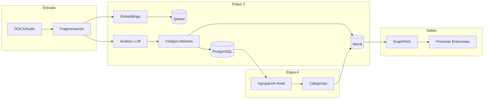

# Revisión de Estrategia Híbrida: Etapas 1-4
## Análisis Cualitativo Basado en Teoría Fundamentada

**Fecha**: 2025-12-17  
**Propósito**: Evaluar la implementación actual del enfoque híbrido (IA + Manual) para las etapas de codificación

---

## 1. Fundamentos Teóricos

La implementación se basa en la **Teoría Fundamentada (Grounded Theory)** de Glaser y Strauss, con las adaptaciones metodológicas de:

1. **Strauss y Corbin (1990)**: Codificación sistemática en tres niveles
2. **Charmaz (2006)**: Enfoque constructivista que reconoce el rol del investigador
3. **Clarke (2005)**: Análisis situacional con mapeo de relaciones

### Principios Metodológicos Clave

| Principio | Implementación en la App |
|-----------|--------------------------|
| **Emergencia** | Códigos surgen de los datos, no impuestos a priori |
| **Comparación constante** | `suggest_similar_fragments()` en `coding.py` |
| **Muestreo teórico** | Filtros por área temática, actor, protocolo |
| **Saturación teórica** | `get_saturation_data()` con curva acumulativa |
| **Sensibilidad teórica** | GraphRAG injection para contexto existente |

---

## 2. Arquitectura del Flujo Híbrido

```
┌─────────────────────────────────────────────────────────────────────────────┐
│                         FLUJO HÍBRIDO DE ANÁLISIS                           │
├─────────────────────────────────────────────────────────────────────────────┤
│                                                                             │
│  ┌─────────────────────────────────────────────────────────────────────┐   │
│  │                    ETAPA 0-1: PREPARACIÓN                           │   │
│  │  ┌─────────────┐    ┌─────────────┐    ┌─────────────────────────┐ │   │
│  │  │ Transcripción│───▶│ Diarización │───▶│ Fragmentación + Ingesta │ │   │
│  │  │ (GPT-4o)    │    │ (speakers)  │    │ (embeddings → Qdrant)   │ │   │
│  │  └─────────────┘    └─────────────┘    └─────────────────────────┘ │   │
│  └─────────────────────────────────────────────────────────────────────┘   │
│                                    │                                        │
│                                    ▼                                        │
│  ┌─────────────────────────────────────────────────────────────────────┐   │
│  │                 ETAPA 2-3: CODIFICACIÓN ABIERTA                     │   │
│  │                                                                      │   │
│  │   ╔═══════════════════════╗    ╔═══════════════════════════════╗   │   │
│  │   ║    CANAL IA           ║    ║      CANAL MANUAL             ║   │   │
│  │   ║ ─────────────────────  ║    ║ ──────────────────────────── ║   │   │
│  │   ║ • analyze_interview_  ║    ║ • assign_open_code()          ║   │   │
│  │   ║   text()              ║    ║ • CodingPanel UI              ║   │   │
│  │   ║ • GPT-5.2-chat        ║    ║ • suggest_similar_fragments() ║   │   │
│  │   ║ • Batch procesamiento ║    ║ • Comparación constante LLM  ║   │   │
│  │   ╚═══════════════════════╝    ╚═══════════════════════════════╝   │   │
│  │                    │                        │                       │   │
│  │                    └────────────┬───────────┘                       │   │
│  │                                 ▼                                    │   │
│  │                    ┌─────────────────────────┐                      │   │
│  │                    │  PostgreSQL: open_codes │                      │   │
│  │                    │  • fragmento_id (vinc.) │                      │   │
│  │                    │  • código emergente     │                      │   │
│  │                    │  • cita literal         │                      │   │
│  │                    └─────────────────────────┘                      │   │
│  └─────────────────────────────────────────────────────────────────────┘   │
│                                    │                                        │
│                                    ▼                                        │
│  ┌─────────────────────────────────────────────────────────────────────┐   │
│  │                   ETAPA 4: CODIFICACIÓN AXIAL                       │   │
│  │                                                                      │   │
│  │   ╔═══════════════════════╗    ╔═══════════════════════════════╗   │   │
│  │   ║    CANAL IA           ║    ║      CANAL MANUAL             ║   │   │
│  │   ║ ─────────────────────  ║    ║ ──────────────────────────── ║   │   │
│  │   ║ • etapa4_axial JSON   ║    ║ • assign_axial_relation()    ║   │   │
│  │   ║ • Inferencia de tipo  ║    ║ • Validación de evidencia    ║   │   │
│  │   ║   (_infer_relation_  ║    ║   (mín. 2 fragmentos)        ║   │   │
│  │   ║    type())            ║    ║ • Louvain communities        ║   │   │
│  │   ╚═══════════════════════╝    ╚═══════════════════════════════╝   │   │
│  │                    │                        │                       │   │
│  │                    └────────────┬───────────┘                       │   │
│  │                                 ▼                                    │   │
│  │                    ┌─────────────────────────┐                      │   │
│  │                    │  Neo4j: Grafo de        │                      │   │
│  │                    │  Categorías y Códigos   │                      │   │
│  │                    │  • Relaciones tipadas   │                      │   │
│  │                    │  • Evidencia vinculada  │                      │   │
│  │                    └─────────────────────────┘                      │   │
│  └─────────────────────────────────────────────────────────────────────┘   │
│                                                                             │
└─────────────────────────────────────────────────────────────────────────────┘
```

---

## 3. Análisis por Etapa

### Etapa 0-1: Preparación y Reflexividad

**Implementación actual** (`analysis.py` líneas 72-77):
```python
QUAL_SYSTEM_PROMPT = """
Etapa 0 - Preparación, Reflexividad: Revisa el texto buscando incoherencias.
Etapa 1 - Transcripción y resumen: Verifica literalidad y elabora resumen breve.
"""
```

| Aspecto | Estado | Observación |
|---------|--------|-------------|
| Verificación de transcripción | ✅ | El LLM detecta incoherencias |
| Resumen ejecutivo | ✅ | `etapa1_resumen` en JSON |
| Reflexividad del investigador | ⚠️ | No hay intervención manual explícita |

**Fundamento teórico**: Strauss & Corbin enfatizan la necesidad de que el investigador reconozca sus sesgos antes de codificar. La actual implementación delegas esto al LLM, lo cual puede ser insuficiente.

### Etapa 2: Análisis Descriptivo Inicial

**Implementación actual** (`analysis.py` líneas 75-76):
```python
Etapa 2 - Análisis Descriptivo Inicial: Resume primeras impresiones y temas 
superficiales. Justifica códigos iniciales.
```

**Salida JSON**:
```json
{
  "etapa2_descriptivo": {
    "impresiones": "...",
    "lista_codigos_iniciales": ["...", "..."]
  }
}
```

| Aspecto | Estado | Observación |
|---------|--------|-------------|
| Primera lectura "naïve" | ✅ | `impresiones` captura esto |
| Códigos provisionales | ✅ | `lista_codigos_iniciales` |
| Anotaciones del investigador | ⚠️ | No hay memo manual pre-análisis |

**Fundamento teórico**: Charmaz recomienda "initial coding" línea por línea antes de agrupar. La app genera códigos iniciales pero no permite refinamiento manual en esta etapa.

### Etapa 3: Codificación Abierta

**Implementación Híbrida**:

1. **Canal IA** (`analysis.py:196-221`):
   - `analyze_interview_text()` procesa fragmentos con índices `[IDX: n]`
   - Genera `etapa3_matriz_abierta` con códigos, citas y `fragmento_idx`
   - Inyección de contexto GraphRAG (`get_graph_context()`)

2. **Canal Manual** (`coding.py:78-124`):
   - `assign_open_code()` permite codificación humana
   - Persiste en PostgreSQL (`open_codes`) y Neo4j (relación Fragmento-Código)
   - Interfaz: CodingPanel en frontend

3. **Comparación Constante** (`coding.py:167-282`):
   - `suggest_similar_fragments()` busca fragmentos semánticamente similares
   - `_generate_comparison_memo()` genera análisis LLM de convergencias
   - Persiste en `constant_comparison` para auditoría

| Aspecto | Estado | Observación |
|---------|--------|-------------|
| Códigos emergentes | ✅ | IA y manual convergen en `open_codes` |
| Vinculación fragmento-código | ✅ | `fragmento_idx` + `match_citation_to_fragment()` |
| Comparación constante | ✅ | Implementada con embeddings + LLM |
| Citas literales | ✅ | Límite de 60 palabras en prompt |
| Saturación teórica | ✅ | `get_saturation_data()` con plateau detection |

**Fundamento teórico**: La comparación constante (Glaser & Strauss) está bien implementada mediante búsqueda vectorial + análisis LLM. El enfoque híbrido permite que el investigador valide/refine los códigos IA.

### Etapa 4: Codificación Axial

**Implementación Híbrida**:

1. **Canal IA** (`analysis.py:362-424`):
   - `etapa4_axial` agrupa códigos en categorías
   - Tipos de relación: `partede`, `causa`, `condicion`, `consecuencia`
   - `_infer_relation_type()` como fallback si el LLM no especifica
   - Evidencia vinculada desde Etapa 3 (`code_fragments`)

2. **Canal Manual** (`axial.py:102-165`):
   - `assign_axial_relation()` con validación de evidencia
   - Requiere mínimo 2 fragmentos únicos para validar relación
   - Detección de comunidades: Louvain sobre grafo Neo4j

| Aspecto | Estado | Observación |
|---------|--------|-------------|
| Agrupación en categorías | ✅ | IA propone, humano valida |
| Tipos de relación | ✅ | 4 tipos basados en Strauss & Corbin |
| Validación de evidencia | ✅ | Mínimo 2 fragmentos requeridos |
| Memos analíticos | ✅ | Campo `memo` en categorías |
| Detección de comunidades | ✅ | Louvain + PageRank |

**Fundamento teórico**: Strauss & Corbin definen la codificación axial como el proceso de relacionar categorías con subcategorías. Los cuatro tipos de relación implementados corresponden a su paradigma de codificación (condiciones, acciones, consecuencias).

---

## 4. Flujo de Datos y Persistencia



---

## 5. Fortalezas del Enfoque Híbrido

| Fortaleza | Descripción |
|-----------|-------------|
| **Escabilidad** | IA procesa volumen, humano valida calidad |
| **Trazabilidad** | Cada código mantiene `fragmento_idx` y cita literal |
| **Consistencia** | Embeddings garantizan coherencia semántica |
| **Contexto acumulativo** | GraphRAG inyecta teoría emergente en cada análisis |
| **Saturación medible** | Curva acumulativa con detección de plateau |
| **Auditabilidad** | Logs estructurados con métricas de linkeo |

---

## 6. Áreas de Mejora Identificadas

### 6.1 Reflexividad del Investigador (Prioridad Alta)

**Problema**: La Etapa 0 delega la reflexividad al LLM, pero Charmaz enfatiza que el investigador debe explícitar sus preconcepciones.

**Solución propuesta**:
- Agregar campo `memo_reflexivo` antes del análisis IA
- Prompt para que el investigador documente supuestos previos
- Comparar memos pre/post análisis

### 6.2 Codificación Línea por Línea (Prioridad Media)

**Problema**: El LLM genera códigos a nivel de fragmento, no línea por línea como recomienda Charmaz para "initial coding".

**Solución propuesta**:
- Modo "micro-coding" que divida fragmentos en oraciones
- Permitir códigos in-vivo emergentes del texto literal

### 6.3 Member Checking (Prioridad Media)

**Problema**: No hay mecanismo para que participantes validen interpretaciones.

**Solución propuesta**:
- Exportar resúmenes por participante
- Panel de validación con feedback estructurado

### 6.4 Triangulación de Fuentes (Prioridad Baja)

**Problema**: Los filtros existen pero no hay comparación sistemática entre tipos de actor.

**Solución propuesta**:
- Matriz de convergencia/divergencia por tipo de actor
- Visualización de patrones cruzados

---

## 7. Conclusión

La implementación actual del enfoque híbrido es **metodológicamente sólida** y alineada con los principios de Teoría Fundamentada de Strauss & Corbin. Las principales fortalezas son:

1. ✅ **Integración IA-Manual**: Códigos de ambos canales convergen en una sola base
2. ✅ **Comparación constante**: Implementada con embeddings + LLM
3. ✅ **Evidencia trazable**: Cada relación axial requiere fragmentos vinculados
4. ✅ **Contexto acumulativo**: GraphRAG enriquece análisis sucesivos

Las mejoras sugeridas (reflexividad explícita, micro-coding, member checking) fortalecerían el rigor metodológico para publicación académica.

---

## Referencias

1. Glaser, B. G., & Strauss, A. L. (1967). *The Discovery of Grounded Theory*. Aldine.
2. Strauss, A., & Corbin, J. (1990). *Basics of Qualitative Research*. Sage.
3. Charmaz, K. (2006). *Constructing Grounded Theory*. Sage.
4. Clarke, A. E. (2005). *Situational Analysis*. Sage.

---

**Documentos de referencia local**:
- `docs/fundamentos_teoria/La_teoria.pdf`
- `docs/fundamentos_teoria/marco teoria empiricamente fundamentada.pdf`
- `docs/fundamentos_teoria/Ejemplificación del proceso metodológico.pdf`
