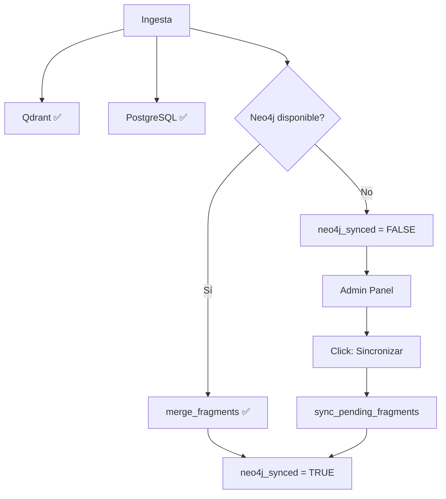

# Sprint 28: Neo4j Resilience & PostgreSQL Fallback

**Fecha:** 2026-01-07  
**Estado:** ✅ Completado  
**Prioridad:** Alta - Requerido para Azure Production

---

## Objetivo

Hacer que la aplicación sea completamente funcional sin Neo4j, permitiendo sincronización diferida cuando la conexión se restablezca. Esto es crítico para:
- Despliegue en Azure donde Neo4j/Memgraph puede no estar disponible inmediatamente
- Resiliencia ante fallos de conexión
- Desarrollo local sin dependencias de infraestructura compleja

---

## Cambios Implementados

### Fase 1: PostgreSQL Fallback para Graph Algorithms

#### [link_prediction.py](file:///c:/Users/osval/Downloads/APP_Jupter/app/link_prediction.py)

**Función nueva:** `_get_graph_data_from_postgres(pg, project_id)`
- Construye grafo desde PostgreSQL usando:
  - `analisis_axial`: Relaciones Categoría → Código
  - `analisis_codigos_abiertos`: Co-ocurrencias en fragmentos
  
**Modificación:** `get_graph_data()`
- Intenta Neo4j/Memgraph primero
- Si falla → fallback a PostgreSQL automáticamente
- Log: `link_prediction.neo4j_failed` + `link_prediction.postgres_fallback`

#### [graph_algorithms.py](file:///c:/Users/osval/Downloads/APP_Jupter/app/graph_algorithms.py)

**Función nueva:** `_extract_graph_data_from_postgres(pg, project_id)`
- Extrae grafo para algoritmos NetworkX (Louvain, PageRank)
- Usa las mismas tablas que link_prediction

**Modificación:** `_extract_graph_data()`
- Refactorizado para intentar Neo4j primero
- Fallback a `_extract_graph_data_from_postgres()` si falla

---

### Fase 2: Neo4j Opcional en Ingesta

#### [ingestion.py](file:///c:/Users/osval/Downloads/APP_Jupter/app/ingestion.py)

**Cambios en inicialización:**
```python
# PostgreSQL primero (datos maestros - crítico)
ensure_fragment_table(clients.postgres)

# Neo4j opcional
neo4j_available = False
try:
    ensure_neo4j_constraints(clients.neo4j, settings.neo4j.database)
    neo4j_available = True
except Exception as e:
    log.warning("ingest.neo4j.unavailable", ...)
```

**Cambios en batch loop:**
1. **PostgreSQL primero** - `insert_fragments()` siempre se ejecuta
2. **Neo4j condicional** - `merge_fragments()` solo si `neo4j_available`
3. **Sync tracking** - `_mark_fragments_sync_status()` marca estado

**Función nueva:** `_mark_fragments_sync_status(pg, fragment_ids, synced)`
- Actualiza columna `neo4j_synced` en `entrevista_fragmentos`
- Permite sincronización diferida

---

### Fase 3: Endpoints de Sincronización

#### [app/neo4j_sync.py](file:///c:/Users/osval/Downloads/APP_Jupter/app/neo4j_sync.py) **[NUEVO]**

**Funciones principales:**

- `get_sync_status(pg, project)` → Dict con pending/synced/total
- `check_neo4j_connection(clients, settings)` → bool
- `sync_pending_fragments(clients, settings, project, batch_size)` → Dict con synced/failed/remaining

**Flujo de sincronización:**
1. Verifica conexión Neo4j
2. Query: `SELECT ... WHERE neo4j_synced = FALSE LIMIT batch_size`
3. Llama `merge_fragments()` con batch
4. Actualiza `neo4j_synced = TRUE` en PostgreSQL
5. Retorna contadores

#### [backend/routers/admin.py](file:///c:/Users/osval/Downloads/APP_Jupter/backend/routers/admin.py)

**Nuevos endpoints:**

```python
GET /api/admin/sync-neo4j/status?project=<project_id>
# Returns: { pending, synced, total, neo4j_available, project }

POST /api/admin/sync-neo4j?project=<project_id>&batch_size=100
# Returns: { synced, failed, remaining, project, batch_size }
```

**Autenticación:** Requiere `require_auth` (admin role)

---

### Fase 4: Frontend Sync UI

#### [frontend/AdminPanel.tsx](file:///c:/Users/osval/Downloads/APP_Jupter/frontend/src/components/AdminPanel.tsx)

**Nuevo componente:** `Neo4jSyncSection`

**Características:**
- Muestra estado de conexión: ✅ Neo4j Conectado / ❌ Neo4j Desconectado
- Contadores: Pendientes | Sincronizados | Total
- Botón: "Sincronizar X fragmentos" (habilitado solo si Neo4j disponible)
- Feedback: Mensajes de éxito/error post-sincronización

**Estilos:** [AdminPanel.css](file:///c:/Users/osval/Downloads/APP_Jupter/frontend/src/components/AdminPanel.css)
- `.admin-panel__neo4j-sync` - Sección con gradiente azul
- `.sync-indicator` - Indicador de conexión (verde/rojo)
- `.sync-button` - Botón con gradiente y hover effects

---

### Migración SQL

#### [010_neo4j_sync_tracking.sql](file:///c:/Users/osval/Downloads/APP_Jupter/migrations/010_neo4j_sync_tracking.sql) **[NUEVO]**

```sql
ALTER TABLE entrevista_fragmentos 
ADD COLUMN IF NOT EXISTS neo4j_synced BOOLEAN DEFAULT FALSE;

CREATE INDEX IF NOT EXISTS ix_fragments_neo4j_pending 
ON entrevista_fragmentos(project_id, neo4j_synced) 
WHERE neo4j_synced = FALSE;

UPDATE entrevista_fragmentos 
SET neo4j_synced = TRUE 
WHERE neo4j_synced IS NULL;
```

**Ejecutar antes de usar la nueva versión:**
```bash
psql -h <host> -U <user> -d entrevistas -f migrations/010_neo4j_sync_tracking.sql
```

---

## Flujo Final de Ingesta



---

## Testing

### Escenario 1: Ingesta sin Neo4j

```bash
# 1. Detener Neo4j/Memgraph
docker stop memgraph

# 2. Ingestar archivo
# Resultado esperado:
# - ✅ Fragmentos en PostgreSQL
# - ✅ Vectores en Qdrant
# - ⚠️ Log: "ingest.neo4j.unavailable"
# - ✅ neo4j_synced = FALSE en DB
```

### Escenario 2: Sincronización diferida

```bash
# 1. Iniciar Neo4j/Memgraph
docker start memgraph

# 2. Admin Panel → "🔄 Sincronización Neo4j"
# Resultado esperado:
# - Estado: ✅ Neo4j Conectado
# - Pendientes: N > 0
# - Click "Sincronizar N fragmentos"
# - ✅ Mensaje: "Sincronizados N fragmentos"
# - Pendientes: 0
```

### Escenario 3: Graph algorithms sin Neo4j

```bash
# Neo4j detenido
# Link Prediction Panel → Ejecutar algoritmo
# Resultado esperado:
# - ✅ Resultados se generan desde PostgreSQL
# - Log: "link_prediction.postgres_fallback"
```

---

## Métricas de Impacto

| Métrica | Antes | Después |
|---------|-------|---------|
| Uptime requerido Neo4j | 100% | 0% (opcional) |
| Tiempo ingesta (Neo4j down) | ❌ Falla | ✅ ~mismo |
| Graph algorithms (Neo4j down) | ❌ Falla | ✅ Funcional |
| Complejidad deployment | Alta | Baja |

---

## Próximos Pasos

- [ ] Monitorear métricas de sincronización en producción
- [ ] Considerar sincronización automática en background (job scheduler)
- [ ] Dashboard de salud Neo4j en Admin Panel
- [ ] Alertas cuando pendientes > threshold

---

## Referencias

- [Implementation Plan](../Revision_Desarrollo/implementation_plan.md)
- [Plan de Despliegue Azure](../Plan_despliegue_app_enAzure.md)
