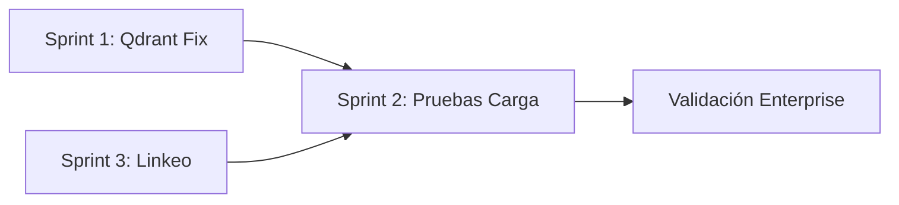

# Sprint Backlog: Estabilización Q1 2025

**Objetivo:** Resolver los 3 bloqueadores principales para validar escalabilidad enterprise.

---

## Sprint 1: Qdrant Timeout Fix
**Duración:** 1 semana | **Prioridad:** 🔴 Crítica (Score: 22.5)

### Problema
Los logs muestran timeout al insertar batches de ~34 fragmentos:
```json
{"event": "qdrant.upsert.split", "reason": "The write operation timed out", "size": 34}
```

### Tareas

| ID | Tarea | Estimación | Archivo(s) |
|----|-------|------------|------------|
| Q1 | Reducir `batch_size` default de 50 a 10 | 0.5h | `app/documents.py` |
| Q2 | Implementar retry con exponential backoff | 2h | `app/qdrant_block.py` |
| Q3 | Agregar timeout configurable via settings | 1h | `app/settings.py`, `app/qdrant_block.py` |
| Q4 | Logging mejorado para diagnóstico de latencia | 1h | `app/qdrant_block.py` |
| Q5 | Test unitario de retry logic | 1h | `tests/test_qdrant_retry.py` |

### Criterios de Aceptación
- [ ] Ingesta de 100 fragmentos sin timeout
- [ ] Retry automático con máximo 3 intentos
- [ ] Log de tiempo de cada operación Qdrant

### Código de Referencia (Q2)
```python
# app/qdrant_block.py
import time
from tenacity import retry, stop_after_attempt, wait_exponential

@retry(
    stop=stop_after_attempt(3),
    wait=wait_exponential(multiplier=1, min=2, max=10),
    reraise=True
)
def upsert_with_retry(client, collection, points, **kwargs):
    start = time.time()
    result = client.upsert(collection, points, **kwargs)
    elapsed = time.time() - start
    logger.info("qdrant.upsert.success", count=len(points), elapsed_ms=elapsed*1000)
    return result
```

---

## Sprint 2: Pruebas de Carga
**Duración:** 2 semanas | **Prioridad:** 🟠 Alta (Score: 27.0)

### Problema
No hay evidencia de que el sistema escale. Las afirmaciones de "procesar miles de entrevistas" no están validadas.

### Tareas

| ID | Tarea | Estimación | Archivo(s) |
|----|-------|------------|------------|
| P1 | Generar dataset sintético de 100 entrevistas | 4h | `scripts/generate_test_data.py` |
| P2 | Script de carga: ingesta batch de N archivos | 3h | `scripts/load_test_ingest.py` |
| P3 | Script de carga: análisis LLM concurrente | 3h | `scripts/load_test_analyze.py` |
| P4 | Métricas de baseline (tiempo, memoria, errores) | 2h | `scripts/benchmark_report.py` |
| P5 | Prueba con 10 entrevistas simultáneas | 2h | Manual |
| P6 | Prueba con 50 entrevistas simultáneas | 2h | Manual |
| P7 | Prueba con 100 entrevistas (objetivo stretch) | 4h | Manual |
| P8 | Documentar resultados y límites reales | 2h | `docs/benchmarks.md` |

### Criterios de Aceptación
- [ ] Conocer el límite real del sistema (X entrevistas/hora)
- [ ] Identificar bottlenecks (Qdrant, LLM, Neo4j, PG)
- [ ] Documentar configuración óptima para producción

### Dataset Sintético (P1)
```python
# scripts/generate_test_data.py
"""
Genera N archivos DOCX con texto de entrevistas simuladas.
Usa lorem ipsum + patrones de pregunta/respuesta.
"""
import random
from docx import Document

def generate_interview(num_paragraphs=30):
    doc = Document()
    for i in range(num_paragraphs):
        role = "Entrevistador:" if i % 2 == 0 else "Entrevistado:"
        text = f"{role} {generate_paragraph()}"
        doc.add_paragraph(text)
    return doc
```

---

## Sprint 3: Fragmento Linkeo
**Duración:** 1.5 semanas | **Prioridad:** 🟡 Media (Score: 13.3)

### Problema
El LLM no siempre devuelve `fragmento_idx`, causando que códigos se salten:
```json
{"event": "analysis.persist.skip_no_idx", "codigo": "resiliencia_comunitaria"}
```

Esto rompe la promesa de trazabilidad Pre-Hoc.

### Tareas

| ID | Tarea | Estimación | Archivo(s) |
|----|-------|------------|------------|
| F1 | Analizar tasa actual de linkeo (% con idx) | 1h | Script análisis de logs |
| F2 | Mejorar prompt para exigir `fragmento_idx` | 1h | `app/analysis.py` |
| F3 | Implementar fallback: buscar cita en fragmentos | 4h | `app/analysis.py` |
| F4 | Crear función `match_citation_to_fragment()` | 3h | `app/documents.py` |
| F5 | Test de matching con citas reales | 2h | `tests/test_citation_match.py` |
| F6 | Métrica de cobertura de linkeo en logs | 1h | `app/analysis.py` |

### Criterios de Aceptación
- [ ] Tasa de linkeo ≥ 90% (actualmente ~50%)
- [ ] Fallback automático cuando LLM no provee idx
- [ ] Métrica visible en logs: `linkeo_exitoso: 45/50`

### Algoritmo de Matching (F3/F4)
```python
# app/documents.py
from difflib import SequenceMatcher

def match_citation_to_fragment(cita: str, fragments: list[str], threshold: float = 0.6) -> int | None:
    """
    Busca el fragmento que mejor coincide con la cita del LLM.
    Retorna el índice del fragmento o None si no hay match suficiente.
    """
    best_idx = None
    best_score = 0.0
    
    for idx, frag in enumerate(fragments):
        score = SequenceMatcher(None, cita.lower(), frag.lower()).ratio()
        if score > best_score and score >= threshold:
            best_score = score
            best_idx = idx
    
    return best_idx
```

### Flujo Corregido en persist_analysis
```python
# app/analysis.py (en persist_analysis)
f_idx = row.get("fragmento_idx")

# Fallback: buscar cita en fragmentos si no hay idx
if f_idx is None:
    cita = row.get("cita", "")
    f_idx = match_citation_to_fragment(cita, fragments_list)
    if f_idx is not None:
        logger.info("analysis.persist.idx_recovered", idx=f_idx, method="citation_match")

if f_idx is None:
    logger.warning("analysis.persist.skip_no_idx", codigo=row.get("codigo"))
    continue
```

---

## Resumen de Sprints

| Sprint | Duración | Recursos | Entregables |
|--------|----------|----------|-------------|
| **1: Qdrant Timeout** | 1 sem | 1 dev | Retry logic, config, tests |
| **2: Pruebas Carga** | 2 sem | 1-2 dev | Dataset, scripts, benchmarks |
| **3: Fragmento Linkeo** | 1.5 sem | 1 dev | Matching algorithm, métricas |

**Total:** ~4.5 semanas

---

## Dependencias



Sprint 1 y 3 pueden ejecutarse en paralelo. Sprint 2 depende de ambos.

---

## Definición de Done (Global)

- [ ] Código con tests unitarios
- [ ] Sin warnings en linter
- [ ] Documentación actualizada
- [ ] PR revisado y mergeado
- [ ] Verificado en ambiente de desarrollo

---

*Documento generado: Diciembre 2024*
