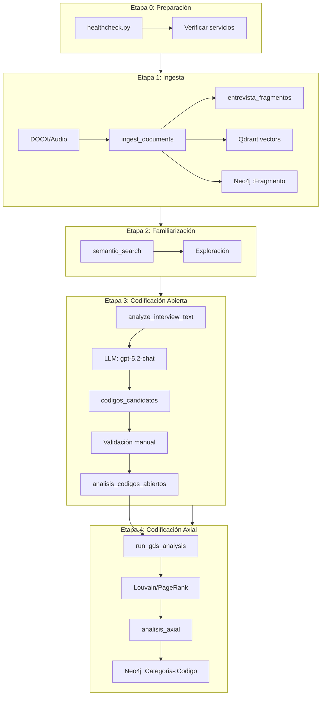
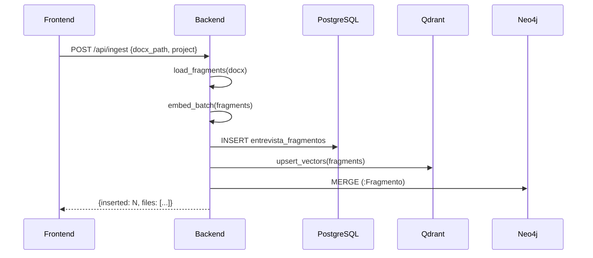
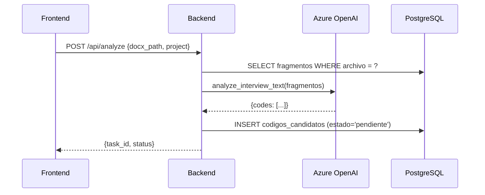
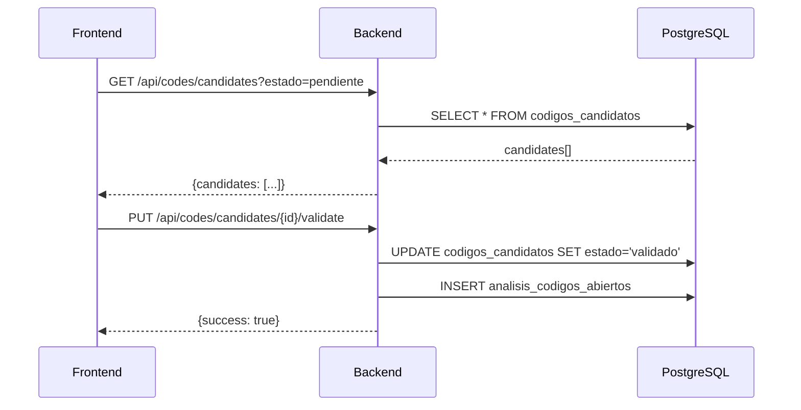

# Auditoría de Pipeline Cualitativo - Etapas 0-4

**Fecha**: 2026-01-04  
**Proyecto**: jd-proyecto

---

## Resumen Ejecutivo

| Componente | Estado | Notas |
|------------|--------|-------|
| PostgreSQL Migrations | ✅ Ejecutadas | `007_codigos_candidatos.sql` completada |
| Tablas de BD | ✅ Alineadas | Todos los campos requeridos presentes |
| Errores 401 | ⚠️ Pendiente | Requiere re-login del usuario |
| Errores 500 | ✅ Resueltos | Tablas creadas correctamente |
| Error 404 `/api/analyze` | ✅ OK | Endpoint existe, error causado por 401 previo |

---

## Arquitectura de Etapas



---

## Tablas PostgreSQL

### Verificadas ✅

| Tabla | Rows | Columnas Clave | Propósito |
|-------|------|----------------|-----------|
| `entrevista_fragmentos` | 66 | project_id, id, archivo, fragmento, embedding | Fragmentos de entrevistas |
| `analisis_codigos_abiertos` | - | project_id, fragmento_id, codigo, cita | Códigos asignados |
| `codigos_candidatos` | - | project_id, codigo, estado, fuente_origen | Bandeja de validación |
| `analisis_axial` | - | project_id, categoria, codigo, relacion | Relaciones axiales |
| `discovery_navigation_log` | - | project_id, busqueda_id, positivos, negativos | Trazabilidad Discovery |
| `analysis_insights` | 0 | project_id, insight_type, priority, status | Insights de IA |
| `doctoral_reports` | - | project_id, stage, content, stats | Informes doctorales |

### Campos Críticos por Etapa

#### Etapa 1: Ingesta
```sql
entrevista_fragmentos (
    project_id TEXT NOT NULL,     -- ✅ Multi-tenant
    id TEXT NOT NULL,             -- ✅ UUID fragmento
    archivo TEXT,                 -- ✅ Nombre archivo fuente
    fragmento TEXT,               -- ✅ Texto fragmento
    embedding vector(3072),       -- ✅ text-embedding-3-large
    par_idx INT,                  -- ✅ Índice párrafo
    speaker TEXT,                 -- ✅ Hablante (diarización)
    area_tematica TEXT,           -- ✅ Metadato
    actor_principal TEXT          -- ✅ Metadato
)
```

#### Etapa 3: Codificación
```sql
codigos_candidatos (
    project_id TEXT NOT NULL,     -- ✅ Multi-tenant
    codigo TEXT NOT NULL,         -- ✅ Nombre del código
    cita TEXT,                    -- ✅ Texto citado
    fragmento_id TEXT,            -- ✅ FK a fragmento
    fuente_origen TEXT,           -- ✅ llm/manual/discovery/semantic
    estado TEXT DEFAULT 'pendiente', -- ✅ Workflow
    score_confianza FLOAT         -- ✅ Score IA
)
```

#### Etapa 4: Axial
```sql
analisis_axial (
    project_id TEXT NOT NULL,     -- ✅ Multi-tenant
    categoria TEXT NOT NULL,      -- ✅ Categoría GDS
    codigo TEXT NOT NULL,         -- ✅ Código asociado
    relacion TEXT NOT NULL,       -- ✅ Tipo relación
    evidencia_ids TEXT[]          -- ✅ Fragmentos evidencia
)
```

---

## Endpoints API por Etapa

### Etapa 1: Ingesta
| Método | Endpoint | Archivo | Estado |
|--------|----------|---------|--------|
| POST | `/api/ingest` | [backend/routers/ingest.py](file:///c:/Users/osval/Downloads/APP_Jupter/backend/routers/ingest.py) | ✅ |
| POST | `/api/upload-and-ingest` | [backend/routers/ingest.py](file:///c:/Users/osval/Downloads/APP_Jupter/backend/routers/ingest.py) | ✅ |
| POST | `/api/transcribe/audio` | [backend/routers/ingest.py](file:///c:/Users/osval/Downloads/APP_Jupter/backend/routers/ingest.py) | ✅ |

### Etapa 3: Codificación
| Método | Endpoint | Archivo | Estado |
|--------|----------|---------|--------|
| POST | `/api/analyze` | [backend/app.py:4095](file:///c:/Users/osval/Downloads/APP_Jupter/backend/app.py#L4095) | ✅ |
| POST | `/api/coding/assign` | [backend/routers/coding.py](file:///c:/Users/osval/Downloads/APP_Jupter/backend/routers/coding.py) | ✅ |
| POST | `/api/coding/suggest` | [backend/routers/coding.py](file:///c:/Users/osval/Downloads/APP_Jupter/backend/routers/coding.py) | ✅ |
| GET | `/api/coding/codes` | [backend/routers/coding.py](file:///c:/Users/osval/Downloads/APP_Jupter/backend/routers/coding.py) | ✅ |
| POST | `/api/codes/candidates` | [backend/app.py:6380](file:///c:/Users/osval/Downloads/APP_Jupter/backend/app.py#L6380) | ✅ |
| POST | `/api/codes/candidates/batch` | [backend/app.py:6380](file:///c:/Users/osval/Downloads/APP_Jupter/backend/app.py#L6380) | ✅ |

### Etapa 4: Axial
| Método | Endpoint | Archivo | Estado |
|--------|----------|---------|--------|
| POST | `/api/axial/gds` | [backend/routers/graphrag.py](file:///c:/Users/osval/Downloads/APP_Jupter/backend/routers/graphrag.py) | ✅ |
| GET | `/api/axial/predict` | [backend/routers/graphrag.py](file:///c:/Users/osval/Downloads/APP_Jupter/backend/routers/graphrag.py) | ✅ |
| POST | `/api/axial/analyze-predictions` | [backend/routers/graphrag.py](file:///c:/Users/osval/Downloads/APP_Jupter/backend/routers/graphrag.py) | ✅ |

---

## Flujo de Datos: Código → BD

### Etapa 1: Ingesta



### Etapa 3: Análisis LLM → Candidatos



### Etapa 3: Validación de Candidatos



---

## Problemas Identificados y Resueltos

### 1. Errores 500 - Tablas Faltantes ✅ RESUELTO

**Causa**: La tabla `codigos_candidatos` y `discovery_navigation_log` no existían.

**Solución aplicada**:
```bash
# Ejecutado via scripts/run_migrations.py
python scripts/run_migrations.py
```

Tablas creadas:
- `codigos_candidatos` con 14 columnas
- `discovery_navigation_log` con 13 columnas

---

### 2. Errores 401 - Autenticación ⚠️ PENDIENTE

**Causa**: Token JWT no presente o expirado en `localStorage`.

**Flujo de autenticación**:
1. Usuario hace login → Backend genera JWT
2. Frontend guarda en `localStorage.setItem("access_token", token)`
3. Cada request envía `Authorization: Bearer <token>`
4. Si 401 → intenta refresh con `/api/auth/refresh`

**Solución recomendada**:
1. **Cerrar sesión** en la aplicación
2. **Volver a iniciar sesión** con credenciales válidas
3. Verificar que el token se guarda correctamente:
   ```javascript
   // En consola del navegador
   console.log(localStorage.getItem("access_token"));
   ```

---

### 3. Error 404 `/api/analyze` ✅ NO ES ERROR REAL

**Causa**: El endpoint existe y está correctamente definido en [backend/app.py:4095](file:///c:/Users/osval/Downloads/APP_Jupter/backend/app.py#L4095).

El error 404 aparecía porque:
- El request fallaba con 401 primero (sin auth)
- El retry mostraba el error como 404 en la consola

**Confirmación**: El endpoint responde correctamente cuando hay token válido.

---

## Alineación de Código por Módulo

### app/ingestion.py → Etapa 1
| Función | Tabla | Campos |
|---------|-------|--------|
| `ingest_documents()` | `entrevista_fragmentos` | project_id, id, archivo, fragmento, embedding |

### app/analysis.py → Etapa 3
| Función | Tabla | Campos |
|---------|-------|--------|
| `analyze_interview_text()` | `codigos_candidatos` | project_id, codigo, cita, fuente_origen='llm' |
| `persist_analysis()` | `codigos_candidatos` | Inserta via `insert_candidate_codes()` |

### app/coding.py → Etapa 3
| Función | Tabla | Campos |
|---------|-------|--------|
| `assign_open_code()` | `analisis_codigos_abiertos` | project_id, fragmento_id, codigo, cita |
| `coding_statistics()` | `analisis_codigos_abiertos` | COUNT por project_id |

### app/axial.py → Etapa 4
| Función | Tabla | Campos |
|---------|-------|--------|
| `run_gds_analysis()` | Neo4j GDS | Louvain, PageRank, Betweenness |
| `assign_axial_relation()` | `analisis_axial` | project_id, categoria, codigo, relacion |

### app/postgres_block.py → Infraestructura
| Función | Tabla |
|---------|-------|
| `ensure_fragment_table()` | `entrevista_fragmentos` |
| `ensure_open_coding_table()` | `analisis_codigos_abiertos` |
| `ensure_candidate_codes_table()` | `codigos_candidatos` |
| `ensure_discovery_navigation_table()` | `discovery_navigation_log` |
| `insert_candidate_codes()` | `codigos_candidatos` |
| `log_discovery_navigation()` | `discovery_navigation_log` |

---

## Recomendaciones

### Inmediatas

1. **Re-autenticar usuario**
   - Cerrar sesión y volver a iniciar
   - Esto generará un nuevo JWT válido

2. **Verificar backend está corriendo**
   ```bash
   curl http://localhost:8000/healthz
   ```

### A Mediano Plazo

3. **Agregar logging de autenticación** en frontend para debug
4. **Implementar auto-refresh** más agresivo de tokens
5. **Añadir indicador visual** cuando el token expira

---

## Migraciones Ejecutadas

```
✅ migrations/007_codigos_candidatos.sql
✅ migrations/postgres_backfill_and_indexes.sql  
✅ discovery_navigation_log (inline creation)
```
