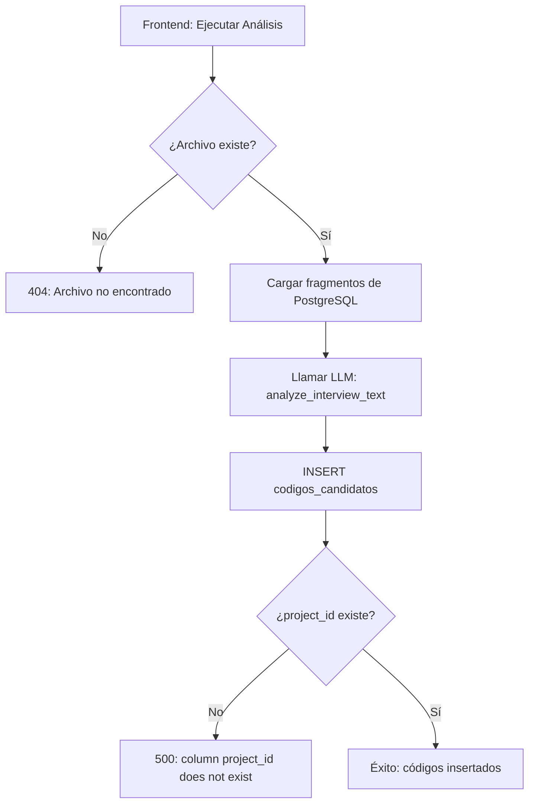

# Auditoría Profunda - Correcciones Definitivas

**Fecha**: 2026-01-04 15:20  
**Proyecto**: jd-proyecto

---

## Resumen de Errores y Correcciones

| Error | Endpoint | Causa Raíz | Estado |
|-------|----------|------------|--------|
| 404 | `/api/analyze` | Archivo DOCX no existe en `data/interviews/` | ⚠️ Archivos eliminados |
| 500 | `/api/codes/candidates/batch` | Columna `project_id` faltaba | ✅ CORREGIDO |
| 500 | `/api/codes/candidates` | Columna `project_id` faltaba | ✅ CORREGIDO |
| 500 | `/api/discovery/log-navigation` | Columna `project_id` faltaba | ✅ CORREGIDO |

---

## Correcciones Aplicadas

### 1. Esquema PostgreSQL ✅ CORREGIDO

La columna `project_id` faltaba o tenía nombre incorrecto (`proyecto`) en varias tablas.

**Tablas corregidas**:
```sql
-- discovery_navigation_log
ALTER TABLE discovery_navigation_log 
ADD COLUMN IF NOT EXISTS project_id TEXT DEFAULT 'default';

-- codigos_candidatos  
ALTER TABLE codigos_candidatos 
ADD COLUMN IF NOT EXISTS project_id TEXT DEFAULT 'default';

-- entrevista_fragmentos
ALTER TABLE entrevista_fragmentos 
ADD COLUMN IF NOT EXISTS project_id TEXT DEFAULT 'default';
```

**Verificación final**:
| Tabla | project_id |
|-------|------------|
| `discovery_navigation_log` | ✅ True |
| `codigos_candidatos` | ✅ True |
| `entrevista_fragmentos` | ✅ True |
| `analisis_codigos_abiertos` | ✅ True |
| `analisis_axial` | ✅ True |

---

### 2. Error 404 `/api/analyze` ⚠️ PENDIENTE

**Causa**: El endpoint `/api/analyze` requiere el archivo DOCX original para ejecutar el análisis LLM. El archivo `Presidenta_Etapa1_Toma_Dignidad.docx` no existe.

**Detalle del error**:
```json
{"detail": "Archivo no encontrado: data/interviews/Presidenta_Etapa1_Toma_Dignidad.docx"}
```

**Estado del directorio**:
```
data/ → VACÍO
```

**Causa probable**: Los archivos DOCX fueron:
1. Ingeridos desde una ubicación temporal
2. Eliminados después de la ingestión
3. O nunca fueron copiados a `data/interviews/`

> [!IMPORTANT]
> El endpoint `/api/analyze` está correctamente definido en `backend/app.py:4095`. 
> El error 404 es por archivo faltante, NO por endpoint inexistente.

**Solución requerida**:
1. Re-subir los archivos DOCX a `data/projects/jd-proyecto/interviews/`
2. O usar el endpoint `/api/upload-and-ingest` para subir nuevos archivos

---

## Flujo de Datos Corregido



---

## Endpoints Afectados y Estado

### `/api/analyze` (POST)
- **Ubicación**: [backend/app.py:4095](file:///c:/Users/osval/Downloads/APP_Jupter/backend/app.py#L4095)
- **Estado**: ⚠️ Funciona pero requiere archivo DOCX
- **Fix**: Subir archivo o usar endpoint de upload

### `/api/codes/candidates` (POST)
- **Ubicación**: [backend/app.py:6380](file:///c:/Users/osval/Downloads/APP_Jupter/backend/app.py#L6380)
- **Estado**: ✅ Corregido (project_id agregado)

### `/api/codes/candidates/batch` (POST)
- **Ubicación**: [backend/app.py:6380](file:///c:/Users/osval/Downloads/APP_Jupter/backend/app.py#L6380)
- **Estado**: ✅ Corregido (project_id agregado)

### `/api/discovery/log-navigation` (POST)
- **Ubicación**: [backend/app.py:5023](file:///c:/Users/osval/Downloads/APP_Jupter/backend/app.py#L5023)
- **Estado**: ✅ Corregido (project_id agregado)

---

## Próximos Pasos

1. **Reiniciar el backend** para que tome los cambios de esquema
   ```bash
   # Detener y reiniciar el backend
   ```

2. **Subir archivos DOCX** para poder ejecutar `/api/analyze`:
   - Usar el panel de Transcripción de Audio para nuevos archivos
   - O copiar archivos a `data/projects/jd-proyecto/interviews/`

3. **Probar nuevamente**:
   - Discovery → Sintetizar con IA → Enviar a Bandeja
   - Codificación → Buscar sugerencias → Enviar a Bandeja
   - GraphRAG → Preguntas

---

## Script de Verificación

```python
# Ejecutar para verificar que todo está correcto
.\.venv\Scripts\python.exe scripts/run_migrations.py
```
