# Investigación de Logs - Dashboard del Ciclo Cualitativo

**Fecha**: 2026-01-04  
**Proyecto**: jd-proyecto  
**Sesión analizada**: Últimos 31 minutos

---

## Resumen Ejecutivo

Se identificaron **4 categorías de errores** en la sesión analizada:

| Tipo | Cantidad | Severidad | Estado |
|------|----------|-----------|--------|
| 401 Unauthorized | ~30 | 🔴 Crítico | Token de autenticación inválido/expirado |
| 500 Internal Server Error | ~15 | 🔴 Crítico | Errores de base de datos |
| 404 Not Found | 1 | 🟡 Medio | Endpoint `/api/analyze` no respondiendo |
| 403 Forbidden | 2 | 🟠 Alto | Acceso a panel Admin sin rol adecuado |

---

## Análisis Detallado

### 1. Errores 401 Unauthorized

> [!CAUTION]
> Todos los endpoints principales están devolviendo 401. Esto indica un problema sistémico de autenticación.

**Endpoints afectados**:
```
/api/interviews
/api/coding/codes
/api/familiarization/fragments
/api/coding/stats
/api/reports/interviews
/api/reports/stage4-summary
/api/codes/candidates
/api/codes/stats/sources
/api/codes/candidates/health
/api/projects
/api/status
/api/admin/stats
/api/admin/users
/api/insights/list
```

**Causa raíz identificada** en [auth.py](file:///c:/Users/osval/Downloads/APP_Jupter/backend/auth.py#L135-174):

```python
async def get_current_user(
    token: Optional[str] = Depends(oauth2_scheme),
    x_api_key: Optional[str] = Header(default=None, alias="X-API-Key"),
) -> User:
    # Opción 1: Bearer JWT
    if token:
        token_data = verify_token(token)
        return User(...)

    # Opción 2: API Key
    if x_api_key and API_KEY and x_api_key == API_KEY:
        return User(user_id="api-key-user", ...)

    # Sin credenciales válidas
    raise HTTPException(status_code=401, ...)
```

**Posibles causas**:
1. **Token JWT expirado** - Los tokens tienen una duración de 240 minutos (4 horas)
2. **Token no enviado** - El frontend no está incluyendo el header `Authorization: Bearer <token>`
3. **Token inválido** - El token fue generado con un `JWT_SECRET_KEY` diferente

---

### 2. Errores 500 Internal Server Error

**Endpoints afectados**:

#### a) `POST /api/codes/candidates/batch` 
Ubicación: [backend/app.py:6380](file:///c:/Users/osval/Downloads/APP_Jupter/backend/app.py#L6380-6434)

**Error en logs**: `column "project_id" does not exist`

**Causa raíz**: La tabla `codigos_candidatos` no fue creada correctamente o le falta la columna `project_id`.

La función `ensure_candidate_codes_table()` debería crear la tabla automáticamente, pero puede fallar si:
- PostgreSQL tiene permisos insuficientes
- La conexión se interrumpe durante la creación
- Existe una versión antigua de la tabla sin la columna

**Migración requerida**: [007_codigos_candidatos.sql](file:///c:/Users/osval/Downloads/APP_Jupter/migrations/007_codigos_candidatos.sql)

#### b) `POST /api/discovery/log-navigation`
Ubicación: [backend/app.py:5023](file:///c:/Users/osval/Downloads/APP_Jupter/backend/app.py#L5023-5066)

**Causa raíz**: La tabla `discovery_navigation_log` no existe o falló su creación.

La función [`log_discovery_navigation()`](file:///c:/Users/osval/Downloads/APP_Jupter/app/postgres_block.py#L194-262) llama a `ensure_discovery_navigation_table()` que debería crear la tabla.

#### c) `POST /api/codes/candidates`
Ubicación funcional: [postgres_block.py:2315](file:///c:/Users/osval/Downloads/APP_Jupter/app/postgres_block.py#L2315-2400)

Mismo problema que el endpoint batch - la tabla `codigos_candidatos` tiene problemas de esquema.

---

### 3. Error 404 Not Found

**Endpoint**: `POST /api/analyze`

**Ubicación esperada**: [backend/app.py:4095](file:///c:/Users/osval/Downloads/APP_Jupter/backend/app.py#L4095)

```python
@app.post("/api/analyze", status_code=202)
async def api_analyze_interview(...)
```

> [!WARNING]
> El endpoint está definido en el código pero devuelve 404. Esto puede indicar que el servidor backend no está levantado correctamente o hay un conflicto de rutas.

**Verificar**:
1. ¿El backend está corriendo en el puerto 5174?
2. ¿El proxy de Vite está configurado correctamente?
3. ¿El servidor se reinició después de cambios de código?

---

### 4. Errores 403 Forbidden

**Endpoints**: 
- `GET /api/admin/stats`
- `GET /api/admin/users`

**Causa**: El usuario actual no tiene el rol `admin` requerido.

El sistema de roles verifica en [auth.py:186-213](file:///c:/Users/osval/Downloads/APP_Jupter/backend/auth.py#L186-213):

```python
def require_role(allowed_roles: List[str]):
    async def role_checker(user: User = Depends(get_current_user)) -> User:
        if not user_roles & allowed_set:
            raise HTTPException(status_code=403, ...)
```

---

## Acciones Recomendadas

### Inmediatas (Críticas)

1. **Verificar autenticación**
   ```bash
   # Probar login en consola del navegador
   fetch('/api/auth/login', {
     method: 'POST',
     headers: {'Content-Type': 'application/json'},
     body: JSON.stringify({email: 'osvaldovegaoses@gmail.com', password: '...'})
   }).then(r => r.json()).then(console.log)
   ```

2. **Ejecutar migraciones de PostgreSQL**
   ```sql
   -- Verificar si la tabla existe
   SELECT * FROM information_schema.tables WHERE table_name = 'codigos_candidatos';
   
   -- Verificar columnas
   SELECT column_name FROM information_schema.columns 
   WHERE table_name = 'codigos_candidatos';
   ```

3. **Reiniciar el backend**
   ```powershell
   # Detener el proceso actual
   # Reiniciar con:
   cd c:\Users\osval\Downloads\APP_Jupter
   .\.venv\Scripts\activate
   uvicorn backend.app:app --reload --port 5174
   ```

### Secundarias

4. **Verificar configuración del proxy Vite**  
   Archivo: `frontend/vite.config.ts` - confirmar que `/api` se proxea a `localhost:5174`

5. **Revisar logs del backend en tiempo real**
   ```powershell
   Get-Content "logs\app.jsonl" -Wait -Tail 50
   ```

---

## Arquitectura de Autenticación

```mermaid
sequenceDiagram
    participant F as Frontend
    participant B as Backend
    participant PG as PostgreSQL
    
    F->>B: POST /api/auth/login
    B->>PG: Validar credenciales
    PG-->>B: Usuario válido
    B-->>F: {access_token, refresh_token}
    
    Note over F: Almacena token en localStorage
    
    F->>B: GET /api/projects (Authorization: Bearer token)
    B->>B: verify_token(token)
    alt Token válido
        B-->>F: 200 + datos
    else Token inválido/expirado
        B-->>F: 401 Unauthorized
    end
```



---

## Archivos Clave Investigados

| Archivo | Propósito |
|---------|-----------|
| [backend/auth.py](file:///c:/Users/osval/Downloads/APP_Jupter/backend/auth.py) | Autenticación JWT y API Key |
| [backend/app.py](file:///c:/Users/osval/Downloads/APP_Jupter/backend/app.py) | Endpoints principales |
| [app/postgres_block.py](file:///c:/Users/osval/Downloads/APP_Jupter/app/postgres_block.py) | Operaciones de BD |
| [migrations/007_codigos_candidatos.sql](file:///c:/Users/osval/Downloads/APP_Jupter/migrations/007_codigos_candidatos.sql) | Esquema tabla candidatos |

---

## Conclusión

Los errores están relacionados con **dos problemas principales**:

1. **Autenticación rota**: El token JWT no se está enviando o es inválido
2. **Esquema de BD incompleto**: Las tablas `codigos_candidatos` y `discovery_navigation_log` no están creadas o tienen columnas faltantes

Se recomienda:
1. Primero cerrar sesión y volver a iniciar sesión para obtener un token fresco
2. Ejecutar las migraciones de PostgreSQL
3. Reiniciar el backend para asegurar que todas las rutas están registradas
